# NOVA — Inventario de diseño y arte

> Parte de la especificación de **NOVA**. Documento maestro: [NOVA_GameDesign_Spec.md](./NOVA_GameDesign_Spec.md).
> **Sección A.** Este documento dice *qué arte hace falta, para qué nodo y en qué estado está*. No dice cómo dibujarlo: eso es el documento de pipeline.
>
> **Ver también:** nodos y niveles en [NOVA_Nodos.md](./NOVA_Nodos.md) · animaciones que consumen estos assets en [NOVA_Estados_Animaciones.md](./NOVA_Estados_Animaciones.md) · bloqueos de desarrollo en [NOVA_Tracking.md](./NOVA_Tracking.md).

---

## A.0 Cómo usar este documento

**Estados:** ⬜ pendiente · 🟨 en progreso · ✅ **generado y disponible en `art/`**.

> `✅` significaba antes "integrado en Unity", lo cual era circular: la tarea
> que integra en Unity es `T6-01`, y la regla de bloqueo exige que el asset
> ya esté `✅` para poder empezarla. `✅` pasa a significar que el PNG existe
> y es definitivo. La integración la sigue certificando el criterio de salida
> de la fase 6 en [NOVA_Tracking.md](./NOVA_Tracking.md).

**Al terminar un asset:** cambia su estado a ✅ y sustituye la celda *Vista previa* por la imagen real, quitando las comillas invertidas:

```
Antes:   ``
Después:  
```

Mientras esté entre comillas invertidas no se renderiza y no rompe el documento. Es el marcador de "falta".

**Regla de bloqueo:** una tarea de desarrollo marcada como dependiente de un `ART-*` que no esté ✅ **no se inicia**. No se sustituye por arte provisional salvo en las fases 1–5, donde las primitivas grises están explícitamente permitidas (ver [NOVA_Tracking.md](./NOVA_Tracking.md), T.2).

---

## A.1 Convención de nombres

```
art/
├── nodes/<nodo>/v<n>/  <tipo>_lvl<n>_<faccion>.png   pulsar/v2/pul_lvl2_player.png
├── states/<estado>/v<n>/  state_<estado>_<variante>.png  frozen/v3/state_frozen_overlay.png
├── fx/                 fx_<id>.png | fx_<id>_sheet.png  fx_cap_sheet.png
├── world/              world_<elemento>.png           world_proton_player.png
├── ui/                 ui_<elemento>.png              ui_powerwheel_slot.png
├── bg/                 bg_<seccion>.png               bg_section1.png
└── _preview/           hojas de contacto, no son asset de juego
```

`<tipo>`: `ast` · `str` · `pul` · `mag` — `<faccion>`: `neutral` · `player` · `enemy`.
Sin espacios, sin mayúsculas, sin acentos. Las hojas de animación llevan sufijo `_sheet` y su número de frames documentado en la columna correspondiente.

**Un nodo por carpeta, una propuesta por subcarpeta.** Los nodos fueron lo primero que se diseñó a base de descartar, y el primer overlay de estado siguió el mismo camino (A.3.1): la Estrella descartó tres anatomías, y el Púlsar, el Magnetar, el Asteroide y el `zzz` de `Dormido` una versión completa cada uno. Las propuestas vivas de un mismo asset conviven en `v1/`, `v2/`… —`art/nodes/<nodo>/v<n>/` para los nodos, `art/states/v<n>/` para los overlays— con **los mismos nombres de archivo dentro de cada una**, así que elegir una es cambiar de carpeta y no renombrar treinta sprites. Una versión descartada no se borra: la razón por la que perdió es la documentación más útil que hay cuando alguien propone lo mismo seis meses después.

**Qué versión es la buena.** La marca este documento, no la carpeta. La columna *Archivos* de cada tabla lleva la ruta con su versión.

`art/` cuelga de la raíz del proyecto, no de `mds/`. Dentro de este documento las rutas de imagen se escriben **`../art/...`** para que la vista previa se renderice.

**Los PNG no se editan a mano.** Cada propuesta sale de un generador `tools/gen_<nodo>_v<n>.py` sobre las primitivas de [NOVA_Arte_Tecnica.md](./NOVA_Arte_Tecnica.md). Para cambiar un asset se cambia su tabla de parámetros y se vuelve a ejecutar.

**El sufijo `_v<n>` va siempre**, aunque el nodo tenga una sola propuesta. Un generador sin versión es una versión que nadie ha numerado todavía, y el día que aparece la segunda hay que renombrar la primera y tocar todo lo que la citaba. Cada generador declara su `NODO` y su `VERSION`, y de ahí sale su carpeta de salida: el nombre del archivo y el destino de los PNG no pueden desincronizarse.

---

## A.2 Nodos

34 sprites base. El sprite cambia con **tipo, nivel y facción** (`NodeVisual.cs`, [15.8](./NOVA_GameDesign_Spec.md#158-presentation)).

### A.2.1 Asteroide — [4.1](./NOVA_Nodos.md#41-asteroide-nivel-0)

**Diseño cerrado: «El Durmiente».** Generador: `tools/gen_asteroide_v1.py` → `art/nodes/asteroide/v1/`.

**La tesis: es el único nodo que no enseña ni un píxel de luz propia.** Los otros tres emiten —corona, conos, campo incandescente—; este solo recibe, y su píxel más claro es un reflejo. No es una decisión de estilo: es la única forma de decir de un vistazo lo que pide [4.1](./NOVA_Nodos.md#41-asteroide-nivel-0) —«no genera, no dispara, no envía, capital muerto»— sin un solo símbolo. Con él, el reparto de materiales cierra:

| Estrella | Púlsar | Magnetar | Asteroide |
|---|---|---|---|
| luz continua | luz tramada | materia que irradia | **materia que solo refleja** |

- **Cuerpo:** `bulto`, contorno orgánico irregular por armónicos sobre el ángulo. Ni círculo, ni elipse, ni polígono: `esferoide` solo da elipses —dos ejes de simetría siempre— y `poliedro` da aristas duras. Una roca no es ninguna de las dos.
- **Superficie:** `crater`, el eje que estaba libre. **Todo el reparto es convexo; nada en el juego se hunde.** Un cráter es una esfera con la normal invertida —misma `L`, mismas bandas, un signo— y por eso se ilumina la pared del fondo en vez de la de delante. Es lo mismo que hace que una foto de la Luna girada 180° convierta los cráteres en cúpulas.
- **Acabado mate, sin especular.** El especular es lo que hace que una superficie se lea como material pulido, y una roca lijada por mil millones de años de micrometeoritos no lo es: un punto blanco encima la convierte en canica. Es el único sitio del proyecto donde saltarse la regla 3 del contrato es lo correcto.
- **Hendiduras:** `veta` en banda oscura, nunca clara. Son sombra en una grieta, no luz que sale.
- **Ojos cerrados.** Dos rendijas, una más cerrada que la otra, inclinadas en espejo — planas se leen como dos grietas más; inclinadas, como párpados, y eso es todo lo que separa una cara de una piedra picada. En reposo es el único del reparto que no te mira. Los abre `ART-ST-SCARE` ([14.2](./NOVA_Estados_Animaciones.md#142-animación-de-susto)), que es asset aparte. La misma cara sirve para `Dormido` (Neutral) y para `SinEncender` (propio): en los dos casos es capital inerte.

**Sin valor aparente, literalmente.** [4.1](./NOVA_Nodos.md#41-asteroide-nivel-0) dice «sin valor *aparente*», y esa palabra manda: la partida se apoya en que el jugador pague 10 por capturarlo y otros 10 por encenderlo **sin que el objeto le prometa nada**. Así que aquí no hay veta incandescente, ni núcleo que se transparente, ni chispa. Hay una piedra apaleada. La promesa la hace el menú de encendido, no el sprite.

**Los cráteres modulan, no sustituyen.** Un cráter aplica un *desplazamiento* sobre la banda que ya tiene cada píxel, no una banda absoluta. Pintados en absoluto, un cráter colocado en la mitad en sombra del cuerpo sale más claro que la roca que lo rodea y se lee como una **ampolla** en vez de como un hoyo: el error no se ve en el lado iluminado, solo en el oscuro. El desplazamiento va además acotado y simétrico, o la pared en sombra salta tres bandas contra dos la iluminada y la hilera entera parece iluminada desde otro sitio.

**La marca de posesión es el overlay, no el sprite.** La columna *Qué debe comunicar* pedía antes «marca de posesión» en la variante del Jugador, y eso choca con [14.0 #3](./NOVA_Estados_Animaciones.md#140-reglas-generales): una variante de facción es la misma llamada de geometría con otra rampa. Se resuelve con el tinte más el icono de ignición parpadeante que [4.1](./NOVA_Nodos.md#41-asteroide-nivel-0) ya obliga a mostrar sobre todo Asteroide propio (`ART-ST-IGN`, [A.3](#a3-estados-y-overlays--141)). **Ninguna geometría cambia entre facciones.**

**Por qué esta versión y no la segunda.** La v2 («El Fragmento», `tools/gen_asteroide_v2.py` → `art/nodes/asteroide/v2/`, conservada) era un fragmento de contorno recto con **caras de fractura** y **estratos paralelos** cruzándolo. Era el diseño más original que ha salido del proyecto: el único organizado por una *dirección sin centro*, cuando los otros cuatro se ordenan alrededor del suyo. Perdió por una razón de tablero:

> **El Asteroide es el nodo más numeroso de la partida**, y el vector de luz `L` es global e inmutable, así que los estratos salen **a la misma diagonal en todos los asteroides de la pantalla**. Ocho piedras rayadas idénticas y paralelas no leen como ocho rocas: leen como papel pintado. Y no se arregla rotando cada instancia, porque rotar el sprite rota su sombreado. Los cráteres son accidentes **puntuales**: repetidos leen como rocas, no como patrón. A 1× se ve además que los hoyos sobreviven al reescalado y los estratos se comprimen en un borrón.

Si algún día los niveles colocan dos o tres asteroides en vez de ocho, o se aceptan varias variantes de estratificación como sprites distintos, la v2 vuelve a estar sobre la mesa. Ver T.7 en [NOVA_Tracking.md](./NOVA_Tracking.md).

| ID | Facción | Qué debe comunicar | Archivo en `art/nodes/asteroide/v1/` | Estado | Vista previa |
|---|---|---|---|---|---|
| `ART-NOD-AST-00N` | Neutral | Roca muerta, dormida, sin valor aparente | `ast_lvl0_neutral.png` | ✅ |  |
| `ART-NOD-AST-00P` | Jugador | La misma roca, rampa `roca_p`. La posesión la marca `ART-ST-IGN` | `ast_lvl0_player.png` | ✅ | 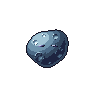 |
| `ART-NOD-AST-00E` | Enemigo | La misma roca, rampa `roca_e` | `ast_lvl0_enemy.png` | ✅ | 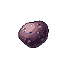 |

**Huella:** 0.67 u, el más pequeño del reparto y en el suelo del rango del contrato. Es nivel 0 y no vale nada: si midiera lo que una Estrella N3, el tablero mentiría sobre dónde está el valor. El suelo lo pone el clic, no el dibujo.

**Idle: transform.** Es el único nodo que queda en ese lado del reparto y no genera hoja — no tiene nada interno que mover ([14.0 #4](./NOVA_Estados_Animaciones.md#140-reglas-generales)).

**Un solo nivel.** Es el único nodo sin escalera, así que no necesita contador y todo el trabajo de lectura se va a la facción.

### A.2.2 Estrella — [4.2](./NOVA_Nodos.md#42-estrella)

El nivel debe leerse de un vistazo: **la estrella crece y arde más**. Es el generador; si el jugador no distingue una N1 de una N4, no puede priorizar objetivos.

**Diseño cerrado.** Cuerpo esférico + atmósfera de dos capas con cizalla espiral. Generador: `tools/gen_estrella_v1.py` → `art/nodes/estrella/v1/`.

- **Cromosfera:** 15 lenguas cortas, casi rectas, una banda más clara.
- **Corona:** 6 lenguas largas y barridas, por debajo de la cromosfera, con fase desplazada media longitud de onda para que no se alineen.
- **Núcleo:** el parámetro `calor` de `esfera()` blanquea el centro al subir de nivel. Es lo que cumple "núcleo blanco" sin cambiar de rampa.
- **Ojos:** dos esferas de la rampa `ojo`, dibujadas las últimas para que nada las tape ([14.7](./NOVA_Estados_Animaciones.md#147-prioridad-visual)).

Descartados, por si se reabre: corona radial simétrica (lee como engranaje), núcleo liso con tres anillos orbitales (lee como símbolo de átomo y el núcleo pierde el protagonismo), cizalla por encima de 1.0 (lee como pelaje).

| ID | Nivel | Señal de nivel | Huella | Archivos (player / enemy) | Estado | Vista previa |
|---|---|---|---|---|---|---|
| `ART-NOD-STR-01` | 1 | Enana apagada. Sin corona, solo cromosfera oscurecida | 0.61 u | `str_lvl1_player.png` · `str_lvl1_enemy.png` | ✅ | 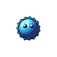 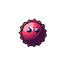 |
| `ART-NOD-STR-02` | 2 | Aparece la corona, núcleo templado | 0.80 u | `str_lvl2_player.png` · `str_lvl2_enemy.png` | ✅ |   |
| `ART-NOD-STR-03` | 3 | Corona continua y más larga | 0.95 u | `str_lvl3_player.png` · `str_lvl3_enemy.png` | ✅ |   |
| `ART-NOD-STR-04` | 4 | Núcleo blanco, corona densa | 1.06 u | `str_lvl4_player.png` · `str_lvl4_enemy.png` | ✅ |   |
| `ART-NOD-STR-05` | 5 | Gigante, halo por trama Bayer | 1.12 u | `str_lvl5_player.png` · `str_lvl5_enemy.png` | ✅ |   |

**Riesgo conocido:** a escala 1×, N3 y N4 se parecen más de lo deseable. Es el escalón débil de la escalera y el precio de haber resuelto el nivel solo con el sprite (A.8 #2). Si molesta en juego, la corrección barata es que el nivel cambie también el grosor de la lengua, no solo su alcance.

**Idle:** hoja de 16 frames, no transform. Una corona congelada delata que el sprite es estático. Pendiente de generar: `str_lvl<n>_<faccion>_sheet.png`.

### A.2.3 Púlsar — [4.3](./NOVA_Nodos.md#43-púlsar)

El nivel del Púlsar **no cambia sus stats**, solo desbloquea poderes ([4.3](./NOVA_Nodos.md#43-púlsar)). El sprite debe decir *cuántos poderes tiene*, no cuánta potencia: la señal de nivel tiene que ser **contable**, no gradual.

**Diseño cerrado: «El Faro».** Generador: `tools/gen_pulsar_v2.py` → `art/nodes/pulsar/v2/`.

Un púlsar no es una bola que irradia: es un faro. Gira tan rápido que se achata, y lo único que el universo ve de él son dos conos de luz que barren. El organizador de la composición no es el centro, es un **eje inclinado 32°**, y ninguna otra pieza del juego tiene una diagonal.

- **Cuerpo:** `esferoide` achatado por rotación, inclinado con el eje. No es una esfera, y es lo primero que lo separa del resto del reparto.
- **Conos de luz:** `cono_trama`, dither Bayer sobre la capa `glow`. **Es luz, no materia**: no hace silueta, no lleva contorno y no cuenta para el hitbox de clic.
- **Frentes de onda:** N arcos abiertos hacia fuera, N = nivel. Es el contador. Un arco abierto es el dibujo universal de «esto se aleja del emisor»; el mismo elemento que cuenta el nivel es el que mueve el idle.
- **Banda ecuatorial:** `anillo_orbital` en dos mitades, trasera antes del cuerpo y delantera después. Dice que el objeto gira y aporta huella sólida.
- **Ojos horizontales**, no rodados con el cuerpo. La criatura mira de frente y la máquina que la rodea está inclinada; rodarlos 58° dejaba la cara volcada y el nodo parecía caerse en vez de girar.

**Por qué esta versión y no la primera.** La v1 (`tools/gen_pulsar_v1.py` → `art/nodes/pulsar/v1/`, conservada) resolvía el nivel con 1, 2 o 3 haces radiales barridos. Funcionaba y era contable, pero compartía con la Estrella los cinco ejes que deciden la lectura de un sprite, y a tamaño de juego un Púlsar N2 y una Estrella N3 eran casi el mismo objeto. **Repintar no arregla eso: dos nodos construidos igual se parecen aunque cambie la paleta.** La v2 voltea los cinco:

| Eje de diseño | Estrella · Púlsar v1 | Púlsar v2 |
|---|---|---|
| Silueta | disco con púas | reloj de arena |
| Simetría | radial *n*-fold, centrada | bilateral sobre un eje a 32° |
| Material del apéndice | banda sólida | luz tramada |
| Composición | isotrópica | direccional |
| Cuerpo | esfera | esferoide achatado |
| Contador de nivel | púas radiales | frentes de onda |

Hoja de contacto de los tres juntos a 1× y 3×: `art/_preview/contraste.png`. La comparación se hace ahí y no en la hoja propia de cada nodo, donde cada uno se ve consigo mismo y siempre parece distinto.

| ID | Nivel | Señal de nivel | Huella | Archivos en `art/nodes/pulsar/v2/` | Estado | Vista previa |
|---|---|---|---|---|---|---|
| `ART-NOD-PUL-01` | 1 | Un frente de onda por lado | 0.69 u | `pul_lvl1_player.png` · `pul_lvl1_enemy.png` | ✅ |   |
| `ART-NOD-PUL-02` | 2 | Dos frentes, cono más largo | 0.94 u | `pul_lvl2_player.png` · `pul_lvl2_enemy.png` | ✅ |   |
| `ART-NOD-PUL-03` | 3 | Tres frentes, núcleo intenso | 1.06 u | `pul_lvl3_player.png` · `pul_lvl3_enemy.png` | ✅ |  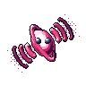 |

**La huella se mide sobre el ciclo entero, no sobre el frame 0.** Los frentes viajan, así que el máximo no cae en el sprite estático: 1.06 / 1.12 / 1.19 u a lo largo de los 16 frames, contra 0.69 / 0.94 / 1.06 u en reposo. Es la cota que obligó a separar `alcance` (materia, cuenta para el hitbox) de `largo` (luz, no cuenta). Ningún nivel toca el borde de la celda de 96.

**Idle:** hoja de 16 frames, no transform. Los frentes nacen en el cuerpo, viajan y se extinguen adelgazando. Las posiciones **no se escriben a mano**: se reparten el recorrido en N tramos iguales, así que en un ciclo cada frente ocupa el sitio del siguiente y el bucle cierra por construcción, sea cual sea el número de frames (verificado: frame 0 ≡ frame 16 píxel a píxel en los tres niveles). Con posiciones a mano el avance y el recorrido no eran conmensurables y el ciclo saltaba al reiniciarse. Pendiente de generar: `pul_lvl<n>_<faccion>_sheet.png`.

**Ningún frente se salta**, ni siquiera el más lejano y tenue: si se dejaran de dibujar, en parte del ciclo se verían dos donde el nivel dice tres y el contador de nivel dejaría de ser fiable, que es lo único que este sprite no se puede permitir.

### A.2.4 Magnetar — [4.4](./NOVA_Nodos.md#44-magnetar)

**Tres facciones**, no dos: el Magnetar neutral existe y dispara ([3.2](./NOVA_GameDesign_Spec.md#32-nota-sobre-el-magnetar-neutral)). El nivel debe correlacionar visualmente con el radio (A.4.1).

**Diseño cerrado: «El Yunque».** Generador: `tools/gen_magnetar_v1.py` → `art/nodes/magnetar/v1/`.

Un magnetar es una estrella de neutrones con el campo magnético más intenso del universo: tan intenso que le agrieta la corteza. Este es un **cuerpo colapsado y tallado**, de caras planas y aristas duras, partido por vetas incandescentes —sus temblores de estrella—, y a su alrededor flotan las **esquirlas** que su campo le arrancó a lo que pasó cerca. No irradia: atrapa. El sprite no enseña un aura: enseña **los restos de lo que ya cazó**.

- **Cuerpo:** `poliedro` de **siete vértices**, ninguno equiespaciado y ninguno con el mismo radio. Siete y no nueve: sobre un cuerpo de 37 px, nueve caras salen tan estrechas que dos contiguas caen en la misma banda, los pliegues desaparecen y el nodo se lee como un canto rodado —que es justo lo que tiene que ser el Asteroide, y lo que este no puede ser—. Con siete, cada cara mide 16 px de lado y el talle se ve.
- **Mesa grande** (0.58 del cuerpo). Con mesa pequeña las caras del talle son enormes y el especular se come media cara; grande, el talle queda como un anillo de facetas estrechas —una piedra tallada— y el brillo cae en una sola faceta.
- **Vetas:** `veta` incandescente, **sobre el pliegue y en el lado en sombra**. Una grieta que recorre la arista entre dos caras se lee como corteza partida por donde debía partirse; una que cruza una cara plana por el medio se lee como una raya pintada encima. Y una línea clara sobre cara clara no se ve: el lado lo elige la `L` global, así que si algún día cambiara el vector de luz las grietas se mudarían solas. De una a tres vetas, con el tono subiendo de templado (N1–N2) a incandescente (N3–N5).
- **Esquirlas:** el mismo `poliedro` en pequeño, y **alargadas** (1.34 × 0.72 de su radio). Una esquirla redonda es un cascote y su giro no se ve; una alargada tiene dirección, y aquí la dirección es toda la información.
- **Ojos:** sobre la mesa —la cara plana del frente es literalmente la cara del bicho—, dibujados los últimos ([14.7](./NOVA_Estados_Animaciones.md#147-prioridad-visual)).
- **Ni un píxel de `glow`.** Ver A.8, partición de materiales. **Verificado:** la capa `glow` sale vacía en los cinco niveles. Silueta y hitbox son la misma figura: este nodo no promete área que no se pueda clicar.

**El campo se dibuja con materia, no con luz.** Cada esquirla se orienta según la dirección real del campo de un dipolo en el punto donde flota: en la base (radial, tangencial), `B = (2·cos f, sin f)` con `f` el ángulo al eje, o sea `giro = ángulo_de_posición + atan2(sin f, 2·cos f)`. No es una fórmula decorativa: lo que sale dibujado son las limaduras de hierro sobre un imán, que es la imagen universal del magnetismo. Sin esto el nodo es una piedra con cascotes alrededor y se pisa con el Asteroide; con esto, **la posición de la materia dibuja el campo que la sujeta**.

**El eje del dipolo es vertical**, a propósito: la diagonal ya es del Púlsar y la isotropía de la Estrella. Vertical es el tercer valor libre, y un eje vertical con la materia repartida sin simetría no lo tiene ninguno de los otros dos.

**El nivel son esquirlas, y la de fuera marca el alcance.** La escalera es **aditiva y posicional**: la esquirla `i` está siempre en el mismo ángulo y a la misma distancia, y el nivel N enseña las esquirlas `0..N-1`. Un N4 es un N3 con una pieza más en un sitio que antes estaba vacío, así que dos niveles contiguos se diferencian por **presencia**, no por grado —el fallo reconocido de la Estrella en A.2.2—. Y la distancia no se inventa: la esquirla `i` orbita al radio de alcance del nivel `i+1` de [4.4](./NOVA_Nodos.md#44-magnetar), comprimido a la celda. La correlación «nivel ↔ radio» que pide A.4.1 es una consecuencia aritmética del generador, no una promesa del documento.

**El ángulo áureo decide dónde.** Cualquier reparto regular (360/N) devuelve simetría radial *n*-fold —la firma de la Estrella—, mueve todas las piezas al subir de nivel y rompe la aditividad. El áureo (137.507°) no cierra nunca, reparte bien para cualquier N y deja fija cada pieza. Es filotaxis: el reparto de las semillas de un girasol.

| ID | Nivel | Radio asociado | Señal de nivel | Huella | Archivos en `art/nodes/magnetar/v1/` | Estado | Vista previa |
|---|---|---|---|---|---|---|---|
| `ART-NOD-MAG-01` | 1 | 2.0 u | Una esquirla | 0.64 u | `mag_lvl1_neutral.png` · `_player` · `_enemy` | ✅ |  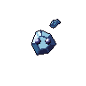 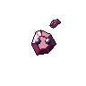 |
| `ART-NOD-MAG-02` | 2 | 2.4 u | Dos esquirlas | 0.94 u | `mag_lvl2_neutral.png` · `_player` · `_enemy` | ✅ | 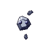 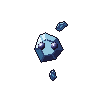 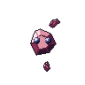 |
| `ART-NOD-MAG-03` | 3 | 2.8 u | Tres esquirlas | 0.94 u | `mag_lvl3_neutral.png` · `_player` · `_enemy` | ✅ |  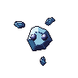 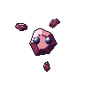 |
| `ART-NOD-MAG-04` | 4 | 3.2 u | Cuatro esquirlas | 1.05 u | `mag_lvl4_neutral.png` · `_player` · `_enemy` | ✅ | 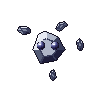  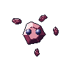 |
| `ART-NOD-MAG-05` | 5 | 3.6 u | Cinco esquirlas | 1.05 u | `mag_lvl5_neutral.png` · `_player` · `_enemy` | ✅ | 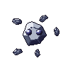  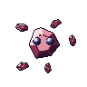 |

**La huella no crece en todos los escalones, y no es un fallo.** Como el ángulo áureo decide dónde cae cada esquirla, la extensión del sprite la fija la pieza más excéntrica, no la última en añadirse: N2 y N3 comparten huella (0.94 u) y N4 y N5 también (1.05 u). El contador de nivel sigue siendo exacto —la esquirla nueva está siempre ahí, en un sitio que antes estaba vacío—; lo que no es monótono es el rectángulo que la contiene. Ningún nivel toca el borde de la celda y los cinco caben en la banda de 0.6 a 1.2 u de A.8 #4, con N1 justo en el suelo de la banda.

**Idle por transform, no hoja.** Este nodo vuelve al lado que le da el contrato. El motivo de la regla —«los que tienen que mover algo interno llevan hoja, porque una corona congelada delata que el sprite es estático»— no le aplica: un cuerpo tallado y unas esquirlas capturadas no tienen nada interno que mover, y la respiración de volumen conservado del contrato basta. `t` existe en la firma del generador solo para que el previsualizador pueda tratar igual a los cuatro nodos. **Consecuencia de inventario:** el Magnetar no aporta hojas; las 15 `mag_lvl<n>_<faccion>_sheet.png` que existen se quedan en `v2/` con la propuesta descartada.

**Por qué esta versión y no la otra.** La v2 («La Botella», `tools/gen_magnetar_v2.py` → `art/nodes/magnetar/v2/`, conservada) era una **botella magnética**: un elipsoide prolato entre dos yugos, envuelto en lazos de campo cerrados `r = R·sin²t` con el grosor siguiendo a `|B|`, calados —la única pieza de NOVA con hueco— y contando el nivel de dentro afuera. Era más explícitamente magnética y contaba mejor. Pierde por tres razones:

| Eje de diseño | Magnetar v1 ✅ | Magnetar v2 (descartada) |
|---|---|---|
| Silueta | cúmulo disperso: cuerpo + satélites | cruz: columna + flor de lazos |
| Espacio interior | macizo | calado |
| Simetría | ninguna (ángulo áureo) | doble espejo sobre el eje |
| Composición | dispersa, centrífuga | anidada, concéntrica |
| Cuerpo | poliedro tallado | elipsoide prolato |
| Contador de nivel | esquirlas capturadas | lazos de campo cerrados |
| Idle | transform | hoja de 16 frames (15 hojas) |

1. **Es el nodo de resistencia ×2 y solo uno de los dos lo enseña.** Un cuerpo macizo, facetado y agrietado se lee como denso; una jaula calada se lee como recinto. Para el nodo que absorbe el doble de Carga ([4.4](./NOVA_Nodos.md#44-magnetar)), densidad es la lectura correcta.
2. **La cara.** La v2 topaba en una desigualdad: cinco lazos anidados necesitan ~4 px de separación —16 px de radio para los cuatro huecos—, y con el lazo exterior topado en 38 px el interior no puede pasar de 22 px, lo que dejaba el cuerpo en ≤ 14 px de semieje. *O cara grande, o cinco lazos anidados: no las dos.* La v1 no paga ese peaje y el cuerpo pasa de 9.5–11.5 px de semieje horizontal a **14.1–17.5**. Con A.8 #5 («cara en todos») y con el susto de [14.2](./NOVA_Estados_Animaciones.md#142-animación-de-susto) como la lectura más importante del juego, tener la cara más pequeña de los cuatro era un coste caro.
3. **Coste de producción.** La v2 necesita 15 hojas de 16 frames a 1536×96 y un bucle que cerrar; la v1, ninguna.

**Lo que se paga.** Las dos objeciones que ganaron el turno anterior siguen siendo ciertas y se asumen, y el cambio añade una tercera pérdida:

1. La v1 dice «magnético» por la orientación de sus esquirlas, que a 1× es un detalle de 2 px; la v2 lo decía de un vistazo.
2. A partir de tres esquirlas la v1 **cuenta mal a 1×**: las piezas son el elemento más pequeño del sprite, al revés que los lazos de la v2. Mitigación disponible sin rediseñar: el radio de A.4.1 es la segunda lectura del nivel y está siempre visible en neutrales y enemigos (A.8 #1), que son los que hay que contar. **Si con el radio en pantalla el nivel sigue sin contarse, la v2 vuelve a la mesa** ([NOVA_Tracking.md](./NOVA_Tracking.md), T.7 #14).
3. Se pierde el **calado**: el eje «espacio interior» vuelve a quedar sin ocupar y los cuatro nodos son macizos.

**La tercera razón del descarte anterior ya no aplica.** Se descartó la v1 en su día también por «pétrea», porque le ponía condiciones al Asteroide, que entonces estaba sin diseñar. El Asteroide cerró con `bulto` —contorno suave, sombreado curvo, mate, sin luz propia— y la v1 es `poliedro` —contorno recto, caras planas, especular, vetas incandescentes—: en `contraste.png` a 1× son una roca gris redonda y un cristal azul facetado con satélites. Lo que sí queda compartido son dos ejes —**simetría** («ninguna» en los dos) e **idle** (transform en los dos)—, más una composición no centrada en ambos. Es el peor par de la tabla de ejes de A.8, y aun así se separan en las otras seis casillas; queda anotado aquí porque un solape conocido no se reabre solo.


---

## A.3 Estados y overlays — [14.1](./NOVA_Estados_Animaciones.md#141-estados-del-nodo)

Se aplican **sobre cualquier sprite de nodo**, así que deben ser independientes del tipo. Cerrados tres, la regla se ha partido en tres casos y conviene tenerlos a la vista antes de diseñar los seis que faltan:

| Caso | Quién | Cómo se resuelve |
|---|---|---|
| Solo van sobre el Asteroide | `Dormido`, `SinEncender` | Se colocan **al lado** del cuerpo, contra la silueta de esa roca. La unión de los cuatro nodos no deja hueco legible para un glifo, pero estos dos nunca van sobre los otros tres (A.3.1, A.3.2). Comparten hueco: uno sustituye al otro, no coexisten |
| Va sobre los cuatro y **aterriza en la cara** | `Asustado` | El asset es de geometría fija, pero **no de posición fija**: tallas discretas más desplazamiento entero por nodo, igual que el protón (A.3.3, A.4.2) |
| **Cubre el cuerpo** | `Congelado` ✅, `Infectado` ✅, `Reconvirtiendo` ✅, `Capturado` ✅ | Son tintes y tránsitos. La regla les vale entera en cuanto a **independencia del tipo**, pero «no registran con nada» resultó falso: un tinte tiene que dejar ver la **cara** —14.6 lo hace compatible con `Asustado`— y el **contador de nivel**, que A.8 #2 dejó solo en el sprite (A.3.4). Y además tiene que convivir con los otros tintes, porque 14.6 los hace coexistir (A.3.5) |
| **Va en la esquina de la celda** | buff ✅ | El cuarto caso, y no estaba previsto: esta tabla tenía el buff entre los tintes y **14.7 lo tenía en la capa 4, con los glifos**. Gana 14.7. No cubre el cuerpo de nadie: es una marca en el cuadrado libre de la esquina, que mide **23 px** en los catorce (A.3.8) |

**Ni un overlay va sobre los cuatro nodos, y conviene saber sobre cuántos va cada uno antes de dibujarlo.** «Se aplican sobre cualquier sprite de nodo» es la regla de partida, no un hecho: 14.1 le pone a cada estado su propio dominio y algunos son bastante más estrechos. `Dormido` y `SinEncender` son solo del Asteroide. `Congelado`, `Infectado` y el buff van sobre **cualquier nodo encendido**, y el Asteroide nunca lo está —encenderlo lo convierte en otro tipo ([4.1](./NOVA_Nodos.md#41-asteroide-nivel-0))—, así que son **trece sprites y no catorce**. `Reconvirtiendo` es aún más estrecho: solo Estrella, Púlsar o Magnetar **propio** ([8.1](./NOVA_GameDesign_Spec.md#81-reglas)). Los únicos que sí van sobre los catorce son `Asustado` y `Capturado`. La lista de congelables vive en `tools/nova_estados.py` (`CONGELABLES`) y es la que recorren la verificación y la hoja de contacto.

**Frames a 12 fps.** Los conteos ya no se eligen: `frames = ceil(duración × 12)` para lo que tiene duración fija, y **16 frames** para los estados persistentes **que se mueven**, que son bucles sin duración ([NOVA_Arte_Tecnica.md](./NOVA_Arte_Tecnica.md), Animación). Los valores anteriores de esta columna implicaban velocidades de entre 4 y 15 fps según el efecto.

**Persistente no quiere decir animado**, y ya hay tres motivos distintos para serlo. `ART-ST-IGN` es de un frame porque su quietud *es* la información —no hay nada que hacer con ese asteroide todavía (A.3.2)—; `ART-ST-FROZEN` porque `Congelado` detiene el idle por definición ([14.1](./NOVA_Estados_Animaciones.md#141-estados-del-nodo)); y `ART-ST-SCARE` porque **a su tamaño no cabe una animación**: medido, cualquier canal se queda en 7 de 16 frames distintos (A.3.3). Un bucle de 16 frames se paga en atlas, y solo se paga cuando el movimiento dice algo **y la rejilla lo deja decir**.

**Y hay un cuarto, que es el tercero otra vez.** `ART-ST-BUFF` también es de un frame, y por el mismo motivo que `ART-ST-SCARE`: medido en los 23 px de la esquina, su compás da **7 frames distintos de 16** (A.3.8). Dos de los nueve assets de A.3 llegaron a esta sección con «16 frames, bucle» en la columna y salieron estáticos; la columna era una previsión escrita antes de que existiera ninguno de ellos, y la rejilla la desmiente igual las dos veces. **El número de frames se mide, no se planifica.**

**Los overlays se traman, no se translucen.** `Congelado`, `Infectado` y el buff se dibujan encima de un sprite ya opaco, y el alfa del proyecto es binario. Se resuelven con `halo_trama()` / dithering Bayer, nunca bajando la opacidad.

| ID | Estado | Qué es | Archivo | Frames | Cálculo | Estado | Vista previa |
|---|---|---|---|---|---|---|---|
| `ART-ST-SLEEP` | `Dormido` | `zzz` flotante, tres glifos que cabecean en su sitio (A.3.1) | `art/states/sleep/v2/state_sleep_sheet.png` | 16 | bucle | ✅ | 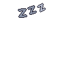 |
| `ART-ST-IGN` | `SinEncender`, `energy < 10` | Brasa quieta: es tuyo, aún no se puede encender (A.3.2) | `art/states/ign/v2/state_unlit_<faccion>.png` | 1 | estático | ✅ | 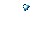 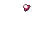 |
| `ART-ST-READY` | `SinEncender`, `energy >= 10` | La brasa se abre en cinco trazos que crepitan: se puede encender ya (A.3.2) | `art/states/ign/v2/state_ready_<faccion>_sheet.png` | 16 | bucle | ✅ | 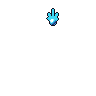 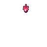 |
| `ART-ST-SCARE` | `Asustado` | **Un ojo** muy abierto, en dos tallas. Se instancia dos veces por nodo con el anclaje de A.3.3 | `art/states/scare/v1/state_scared_<talla>.png` | 1 | estático | ✅ | 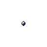 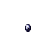 |
| `ART-ST-FROZEN` | `Congelado` | Red de grietas que cruza el nodo, rampa `hielo` (A.3.4) | `art/states/frozen/v3/state_frozen_overlay.png` | 1 | estático | ✅ | 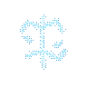 |
| `ART-ST-DECAY` | `Infectado` | Nube tramada sesgada hacia abajo + gotas que caen, rampa `decaimiento` (A.3.5) | `art/states/decay/v2/state_decay_sheet.png` | 16 | bucle | ✅ | 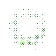 |
| `ART-ST-CONV` | `Reconvirtiendo` | Un frente que barre el nodo, tapa el corte y lo descubre siendo otro (A.3.6) | `art/states/conv/v2/state_convert_<faccion>_sheet.png` | **36** | 3.0 s × 12 | ✅ | 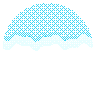 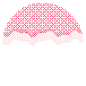 |
| `ART-ST-CAP` | `Capturado` | Dos anillos blancos que se cruzan: uno entra y otro sale (A.3.7) | `art/states/cap/v2/state_captured_sheet.png` | **5** | 0.4 s × 12 | ✅ | 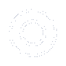 |
| `ART-ST-BUFF` | Power-up activo | Galón en la esquina, en el color del power-up (A.3.8) | `art/states/buff/v1/state_buff_<power>.png` | 1 | estático | ✅ | 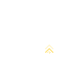 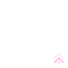 |

**Un overlay por carpeta, una propuesta por subcarpeta.** Misma forma que los nodos y por el mismo motivo: `art/states/<estado>/v<n>/`, con los mismos nombres de archivo dentro de cada propuesta, y la columna *Archivo* marcando cuál es la buena. Sin el nivel `<estado>` la v1 de `sleep` y la v1 de `ign` caerían en la misma carpeta y «v1» dejaría de querer decir nada. Los generadores declaran `ESTADO` y `VERSION` en vez de `NODO` y `VERSION`, y escriben con `dir_estado(estado, version)`.

**Hay tres varas, no una, y es porque hay tres casos.** `verifica()` sirve a los dos glifos del Asteroide: exige **cero** píxeles sobre el cuerpo y la capa `glow` limpia. `verifica_ojos()` sirve a `ART-ST-SCARE`: exige que tape el ojo viejo y que el par deje dos islas. `verifica_tinte()` sirve a los que cubren el cuerpo, y pide lo contrario que la primera —va encima del cuerpo por definición y es trama por obligación—: mide cuánta **cara** sobrevive, cuánto **contador de nivel** sobrevive y cuánto **contraste** tiene el tinte contra el nodo que hay debajo. Aplicarle a un tinte la vara de un glifo sería suspenderlo por hacer su trabajo.

**Las comprobaciones de un overlay viven en `tools/nova_estados.py`**, no en cada generador. Un sprite de nodo se valida contra sí mismo; un overlay se valida además contra **otro asset** —el sprite sobre el que se aplica— y, si es un glifo contable, contra sus propias piezas. Medir cada propuesta a su manera sería no compararlas, así que la vara es una sola y el generador **falla** si algo no pasa, en vez de imprimir un aviso que nadie lee.

### A.3.1 `ART-ST-SLEEP` — `Dormido`

**Diseño cerrado: «El vaivén».** Generador: `tools/gen_state_sleep_v2.py` → `art/states/sleep/v2/`.


Tres glifos `Z` en gris `neutral`, alineados subiendo hacia la derecha por encima de la roca. No viajan: cada uno cabecea en su sitio y sube y baja un píxel, con la fase retrasada hacia fuera, así que el gesto se propaga del que duerme hacia el vacío. El ciclo no cuenta una historia porque `Dormido` no avanza hacia ningún sitio: dura hasta que el nodo es capturado ([14.1](./NOVA_Estados_Animaciones.md#141-estados-del-nodo)).

- **El glifo son tres `veta`:** barra alta, diagonal, barra baja. **No se escribió primitiva nueva, y es deliberado.** La regla del contrato —si un diseño pide un material que no existe, se escribe la primitiva— no se dispara aquí: una Z no es un material, es un segmento sólido de banda constante repetido tres veces. Meter un `glifo_z` en `nova_core` sería meter tipografía en un catálogo de materia.
- **Banda 3, `#8A93A6` literal**, el color que pide 14.1, en las dos Z de dentro; la de fuera sube a banda 2. Se aclara, no se apaga: en esta paleta el índice bajo es el tono claro, y sobre el fondo profundo aclarar es alejar.
- **Cabeceo y bamboleo son el mismo seno.** Girar sin subir es un limpiaparabrisas; subir sin girar es un ascensor. Juntos es algo colgado del aire.

**Ni un píxel de trama, y no es una excepción a A.3.** La regla de arriba habla de **tintes y auras** —`Congelado`, `Infectado`, buff—, que cubren el cuerpo entero y tienen que dejarlo ver. Un `zzz` no cubre nada: es un **glifo**, vive fuera del cuerpo y compite con el fondo, no con el nodo. Tramado sería un borrón gris. Sólido y con contorno se lee sobre cualquier sprite y sobre los tres fondos, que es lo que A.3 pide de verdad cuando exige independencia del tipo.

**La separación entre glifos es la restricción que manda en este asset.** Tres Z que se tocan no se cuentan, y un `zzz` que no se cuenta no dice «duerme»: dice «hay algo gris ahí». Con glifos de 5.0 a 3.9 px de semitamaño hacen falta **16.5 px entre uno y otro**, o sea unos 33 px de recorrido para tres. El primer reparto de este overlay los apiñaba en 7 px y las tres Z salían fundidas en una mancha; no se arregló moviéndolas hasta que se veían bien, se midió.

**El sitio se calculó contra el sprite real.** El Asteroide Neutral ocupa `y 29-67, x 26-68` de la celda de 96, así que el overlay tiene libre la franja de encima y la columna de la derecha, y nada más. De ahí sale el recorrido `(38, 22) → (70, 14)`. **Cero píxeles del overlay caen sobre el cuerpo en ninguno de los 16 frames**, y el generador lo comprueba abriendo el PNG del Asteroide en vez de darlo por hecho.

**Por qué esta versión y no la primera.** La v1 («La escalera», `tools/gen_state_sleep_v1.py` → `art/states/sleep/v1/`, conservada) usa el mismo `zzz`, el mismo arranque, la misma ley de tamaños y la misma separación: **lo único que cambia es el canal de animación**, y por eso la comparación mide la animación y no el encuadre.

| Eje | v1 «La escalera» | v2 «El vaivén» ✅ |
|---|---|---|
| Canal | traslación: las Z recorren el camino | cabeceo en el sitio |
| Ciclo | relevo en tres tramos iguales | onda de fase que se propaga hacia fuera |
| Qué hay en cada sitio | una Z distinta en cada vuelta | siempre la misma |
| Lectura | «sigue exhalando» | «esto lleva así un rato» |

1. **Ningún frame pierde información.** Con alfa binario un glifo no se desvanece: desaparece. En la v1 eso pasa una vez por vuelta y por Z, y [14.0 #5](./NOVA_Estados_Animaciones.md#140-reglas-generales) —«si el estado no se ve, es un bug»— se cumplía por ajuste de tamaños. Aquí se cumple por construcción: las mismas tres Z están en los 16 frames.
2. **La posición deja de ser ruido.** `Dormido` es el estado del Asteroide Neutral y en un mapa hay muchos a la vez. Con la v1, dos asteroides vecinos enseñan sus Z en sitios distintos según la fase en que estén, y el ojo lee movimiento donde no hay información.
3. **Es el gesto correcto para un estado permanente**, que es el argumento del primer párrafo.

**El coste asumido** es el reverso exacto: sin relevo no hay lectura de exhalación, y tres glifos que solo cabecean pueden leerse como un cartel pegado encima en vez de como el bicho respirando. Si en juego el `zzz` parece UI, la v1 está entera en `art/states/sleep/v1/`.

**Un móvil rígido se descartó con números, no por gusto.** La primera forma de esta propuesta colgaba las tres Z de un solo sólido que basculaba alrededor de un pivote en el hombro de la roca. Un grupo de ~50 px girando aunque sea 4° barre 7 px en la punta, y en la celda de 96 no hay sitio: se probaron 64 combinaciones de pivote, amplitud y reparto, y en **todas** la Z exterior invadía la roca o salía de la celda en algún frame. El cabeceo en el sitio da el mismo balanceo sin barrer nada.

**Verificado sobre los 16 frames:** el bucle cierra píxel a píxel (f0 ≡ f16), la capa `glow` está vacía, ningún frame toca el borde de la celda, cero píxeles sobre el cuerpo del nodo y **las tres Z nunca se tocan entre ellas**. Hoja `state_sleep_sheet.png`, 1536×96, 16 frames.

> **Lo que este asset le corrige a A.3.** «Independientes del tipo» no se sostiene medido para los dos overlays de Asteroide. La unión de todos los sprites de nodo vivos ocupa `y 10-88, x 6-92` de la celda: el mayor hueco libre en una esquina son **20 px**, y un `zzz` legible necesita unos 33×16. `Dormido` y `SinEncender` solo se aplican al Asteroide ([14.1](./NOVA_Estados_Animaciones.md#141-estados-del-nodo)), así que se colocan contra **su** silueta y no contra la unión de las cuatro. La regla sigue valiendo entera para `Congelado`, `Infectado`, `Asustado` y el buff, que sí van sobre cualquier nodo. Ver A.8.

### A.3.2 `ART-ST-IGN` y `ART-ST-READY` — `SinEncender`

**Diseño cerrado: «El pedernal».** Generador: `tools/gen_state_ign_v2.py` → `art/states/ign/v2/`.

   

Una brasa sobre la roca. Quieta mientras no hay con qué encender; abierta en cinco trazos que crepitan en cuanto sí. Sustituye al `zzz` de A.3.1 y ocupa **su mismo sitio**: al capturar una roca neutral el símbolo se releva sin saltar de posición.

**Dos lecturas, y el porqué.** [14.1](./NOVA_Estados_Animaciones.md#141-estados-del-nodo) dispara `SinEncender` con `faction != Neutral` a secas, pero [4.1](./NOVA_Nodos.md#41-asteroide-nivel-0) solo deja encender con **10 de Energía**. Con un único icono, el asteroide parpadeaba igual cuando no se podía encender: una promesa que el jugador no siempre puede cobrar.

| | Qué dice | Qué es | Frames |
|---|---|---|---|
| `ART-ST-IGN` | «es tuyo, todavía no» | la brasa sola, quieta | 1, estático |
| `ART-ST-READY` | «enciéndelo ya» | la brasa más los cinco trazos, crepitando | 16, bucle |

**No es un estado nuevo.** El animador elige variante leyendo `energy >= 10`, que es exactamente lo que le permite [14.0 #1](./NOVA_Estados_Animaciones.md#140-reglas-generales) —la presentación solo lee—. `NodeState`, `NodeStateMachine` y la matriz de compatibilidad de [14.6](./NOVA_Estados_Animaciones.md#146-matriz-de-compatibilidad) **no se tocan**. Lo que sí cambia es el reparto del *parpadeo*: 14.1 lo pedía para todo `SinEncender` y ahora es la firma de la lectura accionable.

**La diferencia es de presencia y de material, no de grado.** Un icono que solo se distingue por tener los trazos más cortos se distingue por grado, que es el fallo reconocido del escalón N3→N4 de la Estrella (A.2.2). Aquí el apagado no tiene **ni un trazo**, y además su cuerpo no es el núcleo del encendible en pequeño: es un `bulto` irregular encendido por dentro —un carbón, no una canica—, con el centro ardiendo y el borde apagándose por desplazamiento de banda.

**El apagado no puede pesar más que el encendible, y eso se midió.** Sería el estado sobre el que hay que actuar siendo el más callado de los dos. **141 px la brasa contra 143–196 el abanico**, sin cruzarse en ningún frame; de ahí sale el suelo del parpadeo (`K0`), que no es una elección estética. En una versión anterior sí se cruzaban —120 px en el valle contra 156 px de la piedra fría— y no se vio mirando, se vio contando píxeles.

**Cuatro símbolos de apagado descartados**, todos medidos sobre el fondo real: el pedernal facetado y frío (78 px, se pierde), dos esquirlas (68 px, leen como escombro), una llamita de tres trazos cortos (la más bonita, pero a 1× es un abanico pequeño: grado otra vez) y una esfera lisa (no parece un símbolo, parece un píxel suelto).

- **El abanico no es radial.** Los cinco trazos salen hacia arriba, entre −142° y −38°, con largos distintos. Cualquier destello isótropo es la firma de la Estrella, que además es **una de las tres cosas** en las que este asteroide puede encenderse ([4.1](./NOVA_Nodos.md#41-asteroide-nivel-0)): prometería de más. Un destello de ocho puntas centrado fue la primera forma de esta propuesta y se descartó por eso.
- **Los trazos no tocan el núcleo.** Arrancan a `R0` del centro, así que hay hueco entre la brasa y sus rayos: eso lee «saltando», no «irradiando». Una corona sale del cuerpo; una chispa ya se ha separado.
- **Los trazos de fuera van retrasados de fase**, así que la chispa crepita del centro hacia los lados en vez de inflarse en bloque. Mismo recurso que el `zzz` de A.3.1 y que el realce del Magnetar.

**Dos facciones, no una,** y es el único overlay de A.3 que las tiene. A.2.1 cerró que **la marca de posesión del Asteroide es este overlay, no el sprite** —ninguna geometría cambia entre facciones ([14.0 #3](./NOVA_Estados_Animaciones.md#140-reglas-generales))—. Un icono gris no marcaría nada: la roca propia y la enemiga solo se separan por un tinte deliberadamente sutil, porque es capital muerto. Lleva el color literal de [14.4](./NOVA_Estados_Animaciones.md#144-paleta-funcional), `#3FD7F5` y `#F2456B`, en las rampas `str_p` y `str_e`.

> **Las rampas se llaman como la Estrella y no lo son.** `str_p` y `str_e` guardan en su índice 3 los dos colores de facción que 14.4 exige, y no hay rampa de facción genérica en la paleta. Usarlas es lo correcto hoy; si algún día se separan, este es el asset que hay que revisitar.

**Por qué esta versión y no la primera.** La v1 («El interruptor», `tools/gen_state_ign_v1.py` → `art/states/ign/v1/`, conservada) era el símbolo universal de encendido: anillo abierto por arriba y barra saliendo por el hueco, con el apagado quitando la barra y el parpadeo resuelto por salto de banda. Se lee sin aprender nada y es más legible que esta —306 px constantes contra 143–196—. Pierde por una razón de mundo: **NOVA no tiene un solo símbolo de interfaz dentro del tablero**. El nivel se lee en el sprite, la posesión en la rampa, el alcance en un anillo de mundo. Un botón de encendido sería el primer icono de aplicación del juego, y en un tablero de rocas y estrellas se nota.

**El coste asumido** es que una chispa se acerca más a la Estrella que un anillo, y que pesa la mitad. Si en juego el icono no se ve entre ocho asteroides, la v1 está entera en `art/states/ign/v1/`.

**Verificado en las cuatro combinaciones** —dos lecturas × dos facciones—: el bucle cierra píxel a píxel, la capa `glow` está vacía, ningún frame toca el borde y **cero píxeles sobre el cuerpo de la roca**, medido contra `ast_lvl0_player.png` y `ast_lvl0_enemy.png` y no contra una suposición.

### A.3.3 `ART-ST-SCARE` — `Asustado`

**Diseño cerrado: «Los ojos como platos».** Generador: `tools/gen_state_scare_v1.py` → `art/states/scare/v1/`.

 

Es **la lectura más importante del juego** ([14.2](./NOVA_Estados_Animaciones.md#142-animación-de-susto)): dice de un vistazo qué está a punto de caer. Va sobre cualquier nodo —propio, enemigo y neutral—, [14.6](./NOVA_Estados_Animaciones.md#146-matriz-de-compatibilidad) lo hace compatible con todo porque siempre debe poder avisar, y es el primer overlay de A.3 que se dibuja **sobre el cuerpo** en vez de en el hueco de al lado.

**Qué es este asset y qué no es.** 14.1 pide «ojos muy abiertos, temblor, salto corto», pero el temblor y el salto ya están repartidos: son la **capa 5 de [14.7](./NOVA_Estados_Animaciones.md#147-prioridad-visual)**, «sacudida de transform», y los resuelve Unity moviendo el nodo entero. Hornearlos en la hoja sería pagarlos dos veces y dejaría el hitbox temblando. Aquí se dibuja **solo el ojo**.

#### El problema era el anclaje, no el dibujo

Un ojo asustado es fácil; que caiga encima de los ojos de cuatro nodos distintos, no. Medido sobre los 34 sprites, localizando los tonos exclusivos de la rampa `ojo`:

| | |
|---|---|
| Centro en x | **47.0 – 47.5** en todos. Prácticamente registrado |
| Centro en y | 41.1 – 45.5. La Estrella sube con el nivel |
| Separación | **9.5 – 16.0 px.** Factor 1.7 entre el Púlsar N1 y la Estrella N5 |
| Ojo más grande | 10 × 10 px (Estrella N5) |

**Ningún overlay de geometría fija aterriza en los 34**, y escalarlo está prohibido: con `Filter Mode: Point` una escala no entera rompe el pixel-perfect (contrato, *Resolución*). Es exactamente la restricción que obligó al protón a tener tres sprites discretos en vez de escala continua (A.4.2), y la salida es la misma: **tallas discretas más desplazamiento entero.**

**Con una vuelta de tuerca: el asset es un ojo, no un par.** Se instancia dos veces por nodo, cada una en su ancla, así que la separación y la deriva vertical se resuelven con enteros sin tocar el sprite. **Dos archivos cubren los catorce nodos** —la facción no interviene: los cuatro generadores dibujan los ojos con la rampa `ojo`, que es la misma para los tres bandos—.

#### La forma salió de una desigualdad

El ojo tiene que cumplir dos cosas a la vez, y las dos se comprueban contra los sprites de verdad:

1. **Tapar** el ojo viejo. Si asoma un borde se leen cuatro ojos.
2. **No fundirse** con su pareja. Dos ojos pegados son un visor, y un visor no tiene expresión.

Con ojos **redondos** las dos se pelean: tapar el de 10 px de la Estrella N5 pide 10 de ancho, y no fundirse en el Púlsar N1 pide menos de 9.5. **El intervalo es vacío.** Añadiendo el contorno, que engorda 1 px por lado, 5 de los 14 nodos se fundían en un solo bulto.

> **Un ojo asustado es más alto, no más ancho.** El ancho lo raciona la separación; la altura no la raciona nada. Con elipses altas, **dos formas —6×8 y 8×12— cubren los catorce**, tapan siempre y abren el ojo al menos 2 px en todos. La restricción eligió la forma, y resulta que la forma que elige la restricción es la correcta: nadie abre los ojos a lo ancho.

#### Tabla de anclaje

Vive en `tools/nova_estados.py` (`OJOS`), que es de donde la leen el generador y su verificación. Desplazamiento **entero** desde el centro de celda; la facción no entra.

| Nodo | Talla | Ancla izq. | Ancla der. | | Nodo | Talla | Ancla izq. | Ancla der. |
|---|---|---|---|---|---|---|---|---|
| Asteroide | chico | (−8, −2) | (+6, −2) | | Púlsar N1 | chico | (−6, −2) | (+4, −2) |
| Estrella N1 | chico | (−6, −4) | (+5, −4) | | Púlsar N2 | chico | (−6, −2) | (+4, −2) |
| Estrella N2 | grande | (−7, −5) | (+6, −5) | | Púlsar N3 | chico | (−6, −3) | (+5, −3) |
| Estrella N3 | grande | (−8, −6) | (+6, −6) | | Magnetar N1 | chico | (−6, −2) | (+6, −2) |
| Estrella N4 | grande | (−8, −6) | (+7, −6) | | Magnetar N2–N3 | grande | (−7, −3) | (+6, −3) |
| Estrella N5 | grande | (−8, −6) | (+8, −6) | | Magnetar N4–N5 | grande | (−8, −2) | (+6, −2) |

#### Sin animación, y no por ahorrar

Es un asset de **un frame por talla**, y no es una decisión de coste: **no cabe una animación**. Se probaron los tres canales que este proyecto usa a tamaño pequeño y los tres se los come la rejilla:

| Canal | Frames distintos de 16 |
|---|---|
| Pupila que se desplaza | 7 – 9 |
| Pupila que se contrae | 5 – 8 |
| Esclerótica que pulsa | 2 – 8 |

Un ojo de 6×8 px tiene una pupila de 3 px y unos 2 px de juego; subir el recorrido no ayuda, **satura en 9**. Una hoja de 16 frames que solo contiene 7 imágenes distintas no es una animación: es un atlas mintiendo sobre su tamaño. Y el estado **ya se mueve**, porque lo sacude el transform de la capa 5. Es el mismo criterio que dejó el idle del Asteroide y el del Magnetar en transform.

#### De qué está hecho

- **`esferoide` para la esclerótica**, con `calor` alto para llevar la rampa `ojo` —que es oscura— a su extremo claro. Mismo material que los ojos normales de los cuatro nodos, porque es **el mismo ojo abierto de golpe**, no un adorno pegado encima.
- **`esferoide` otra vez para la pupila**, pequeña y con `apagado`.
- **La pupila va pequeña y baja.** Pequeña porque una pupila contraída dentro de mucha esclerótica es la señal universal de sobresalto; baja porque el ojo se abre hacia arriba —eso es lo que hace el párpado— y una pupila centrada en una elipse alta da un ojo de muñeco: sorprendido, no asustado.

**Por qué esta versión y no la otra.** La v2 («La pupila dilatada», `tools/gen_state_scare_v2.py` → `art/states/scare/v2/`, conservada) comparte anclaje, tallas, material y quietud: lo único que cambia es la pupila —34 % del ojo contra 20 %, y casi centrada en vez de baja— y con ella de qué miedo se habla. La contraída es el **sobresalto**: adrenalina, la pupila se cierra de golpe. La dilatada es el **pavor**: la pupila se abre para tragar luz. Medido sobre los 14 nodos, la zona de los ojos se oscurece −27.6 de luminancia media con la v1 y −42.3 con la v2, así que **el número no decide**: las dos cambian la cara mucho. Decide la lectura, y el sobresalto es lo que 14.2 describe —un nodo que ve venir el golpe—, no el miedo largo.

**El coste asumido** es que mucha esclerótica y poca pupila empujan al bicho hacia el dibujo animado. Si en juego los cuatro nodos asustados parecen de otra serie, la v2 está entera en `art/states/scare/v2/`.

**Verificado sobre los 14 nodos** —los cuatro tipos, todos sus niveles—: **cero píxeles del ojo viejo asomando** y **dos islas conexas** en todos. La comprobación vive en `tools/nova_estados.py` (`verifica_ojos`) y abre los PNG de los nodos para medir, en vez de dar el anclaje por bueno.

### A.3.4 `ART-ST-FROZEN` — `Congelado`

**Diseño cerrado: «El vidrio».** Generador: `tools/gen_state_frozen_v3.py` → `art/states/frozen/v3/`.


**El hielo no es una capa, es una grieta.** Un tinte que añade material encima del nodo tiene que negociar cuánto tapa; una red de líneas de 1 px no negocia nada, porque una línea no tiene área. Dice además lo que [7.3](./NOVA_GameDesign_Spec.md#73-cero-absoluto) describe —un cuerpo **sólido y quebradizo**, inerte, que solo puede recibir impactos— y lo dice sin animarse, que es lo que 14.1 exige con «idle detenido» y el motivo por el que este asset es de un frame.

Trece segmentos: un tronco con cuatro nudos, cinco ramas que salen y no vuelven, y dos astillas sueltas. Un vidrio roto tiene esquirlas además de grietas, y sin ellas la red parece un dibujo.

#### El problema no era dibujar hielo

Era que no hay ningún radio libre. Medido sobre los trece congelables:

| | |
|---|---|
| La cara | `x 35-60, y 37-49`, unión de los ojos de los trece |
| El contador de nivel | **de `r 13` a `r 40`.** Frente interior del Púlsar N3 a 13; esquirla exterior del Magnetar N5 a 40 |
| Cuerpos | Magnetar 15–18 px de radio, Estrella N1 20.7, Estrella N5 44.6 con corona |

Las dos son intocables y por razones distintas. La **cara**, porque [14.6](./NOVA_Estados_Animaciones.md#146-matriz-de-compatibilidad) hace `Congelado` compatible con `Asustado` y [14.2](./NOVA_Estados_Animaciones.md#142-animación-de-susto) dice que el susto «siempre debe poder avisar»: un tinte que entierra los ojos convierte esa casilla de la matriz en mentira. El **contador**, porque A.8 #2 cerró que el nivel se lee solo en el sprite, y un nodo congelado es exactamente el que el jugador está decidiendo si captura —se descongela vaciándolo y se lo lleva el último emisor—. Taparle el nivel es taparle el precio.

> **Los contadores ocupan todos los radios entre 13 y 40 px.** No hay ningún radio al que poner un anillo de material denso sin caer encima de alguno. Esa es la frase que descartó las otras dos propuestas y la que explica por qué la que gana está hecha de líneas.

#### La cara no se esquiva: se enhebra

Las dos propuestas descartadas le abrían hueco a la cara —una le dejaba una ventana, la otra le ponía un cristal delante—. Esta pasa por el medio, y puede porque la geometría lo permite y está medida:

> En los trece congelables el **ojo izquierdo termina como muy tarde en `x 45`** y el **derecho empieza como muy pronto en `x 49`**. Hay un **pasillo de 4 px** que existe en los trece, y el tronco de la grieta baja por ahí.

No es un hueco que haya que respetar: es el único sitio por el que una grieta puede cruzar la cara sin tocarla, y **cruzarla es justo lo que la hace leer como grieta** y no como adorno pegado al lado. Medido, la cara conserva entre el **92.9 %** y el **100 %** de sus píxeles.

El pasillo es un dato de los sprites, no un invento de este asset, y queda anotado porque el siguiente overlay que tenga que cruzar una cara lo va a necesitar.

#### La trama florece desde la grieta

14.1 pide los cristales «por trama», y aquí la trama no es un campo con forma propia: es una **función de la distancia a la red**. La escarcha brota de la grieta y se apaga en 4.2 px. Así el overlay tiene **una sola fuente de forma** en vez de dos, y por el pasillo de la cara el florecimiento cabe entero sin desbordarse a los ojos.

#### Sin simetría y sin centro

La red no se organiza alrededor de nada: no tiene centro, no tiene eje y no se repite. Es el único principio de composición que le queda libre a un overlay que va sobre los tres nodos, porque cualquier otro choca con la firma de alguno de ellos (A.8, *Ejes de diseño ya ocupados*). **Un copo de nieve de seis puntas habría sido lo obvio y lo peor:** simetría radial *n*-fold centrada es exactamente la Estrella.

#### Las líneas no llevan contorno

`veta_luz`, no `veta`. Sobre un sprite ya dibujado el contorno no separa, **tacha**: engorda cada línea de 1 a 3 px y los dos de más son negros. Esta propuesta es casi toda línea, así que es la que más lo notaría. El hallazgo salió midiendo la propuesta descartada «El bloque», donde doce aristas con contorno se llevaban por delante el **71 %** de un frente de onda del Púlsar —33 px de relleno y 35 de contorno sobre una pieza de 142—, y de ahí sale la primitiva y la regla del contrato.

#### Verificado sobre los trece nodos

`verifica_tinte` en `tools/nova_estados.py`, abriendo los PNG de los nodos para medir:

| | |
|---|---|
| Huella del overlay | 451 px, no toca el borde de la celda |
| Cara libre | **92.9 % – 100 %** (peor: Púlsar N1) |
| Contador de nivel | la pieza peor parada conserva **68.3 %** (esquirla del Magnetar) |
| Contraste contra el nodo | **73.4 – 128.0** de luminancia media (peor: Estrella N5) |
| Cubre del sprite | 11.8 % – 19.7 % |

#### Por qué esta versión y no las otras dos

| Eje | v1 «La escarcha» | v2 «El bloque» | **v3 «El vidrio» ✅** |
|---|---|---|---|
| Tesis | el frío se le echa encima | es una caja, no una temperatura | **es una grieta, no una capa** |
| Origen de la forma | 5 núcleos desiguales sobre el cuerpo | prisma centrado, contorno recto | **red sin centro ni eje** |
| Material | trama pura + agujas cortas | facetas tramadas, volumen en las aristas | **líneas + trama que florece desde la grieta** |
| Qué hace con la cara | ventana de borde rizado | la mesa del prisma delante | **la enhebra por el pasillo de 4 px** |
| Huella | **317 px** | 1278 px | 451 px |
| Cara libre, peor nodo | **100 %** | 80.8 % | 92.9 % |
| Contador, peor pieza | 74.8 % | 64.1 % | 68.3 % |
| Contraste, peor nodo | 79.1 | **91.5** | 73.4 |

Las tres pasan las comprobaciones en los trece. Decide otra cosa:

1. **No mete una figura de interfaz en el tablero.** «El bloque» era la más legible de las tres a 1× y por eso estuvo elegida un tiempo, pero es la primera figura de contorno **recto y regular** que entraría en NOVA, y ese es exactamente el argumento que descartó la v1 de `ART-ST-IGN` (A.3.2): «NOVA no tiene un solo símbolo de interfaz dentro del tablero». El riesgo no era que estuviera mal dibujada, era que a 1× se leyera como un recuadro de UI.
2. **Es la más barata de las tres en lectura y no renuncia a nada.** Deja la cara casi entera y el contador casi entero, con 451 px contra 1278. Una grieta **cruza**; un tinte **cubre**.
3. **Le deja sitio al siguiente overlay.** `Congelado` convive con `Infectado` ([14.6](./NOVA_Estados_Animaciones.md#146-matriz-de-compatibilidad)), y una red de líneas nítidas sobrevive encima de una nube tramada mientras que un prisma macizo se la come. Esto se vio en la hoja, no en los números: ver A.3.5.

**El coste asumido** son dos cosas, las dos reales:

1. **Puede no decir hielo.** Una red de grietas cianes también se lee como «agrietado», y agrietado ya lo dice el Magnetar con sus vetas incandescentes. Es el único punto de las tres propuestas donde hay riesgo de colisión con la firma de un nodo, y cae justo sobre el nodo con el que colisiona.
2. **Puede no verse.** A 1× una red de 1 px sobre un sprite de 30 px es lo primero que se pierde, y `Congelado` dura hasta 30 s: un estado largo que no se ve es peor que uno corto que se ve poco. Es la propuesta de **menor contraste sobre la Estrella N5** (73.4).

Si en juego pasa lo primero sobre un Magnetar, o lo segundo sobre una Estrella grande, «El bloque» está entero en `art/states/frozen/v2/` y «La escarcha» en `art/states/frozen/v1/` ([NOVA_Tracking.md](./NOVA_Tracking.md), T.7 #18 y #19).

### A.3.5 `ART-ST-DECAY` — `Infectado`

**Diseño cerrado: «El miasma».** Generador: `tools/gen_state_decay_v2.py` → `art/states/decay/v2/`.


Primer tinte **animado** de A.3: hoja de 16 frames, bucle. Una nube tramada alrededor del cuerpo que respira, sesgada hacia abajo, y cinco gotas que se descuelgan de su borde inferior. Es la lectura literal de [14.1](./NOVA_Estados_Animaciones.md#141-estados-del-nodo) —«aura verde pulsante … y partículas descendentes»— y se eligió por la razón más simple que hay: **es la que más se ve**.

#### El terreno: no hay cuerpo donde pintar

Medido sobre los mismos trece nodos encendidos:

> El cuerpo **común a los trece** son **505 px**, un bulto de radio ≤ 19.9 en `x 36-60, y 30-60`. La caja de la cara se come la mayor parte: quedan **228 px**, y **195 de esos 228 están debajo de la cara**. Encima de la cara quedan **33**.

O sea que «pintar sobre el cuerpo» y «pintar en los trece» solo son compatibles en una franja estrecha justo bajo los ojos. Las tres propuestas son tres respuestas a eso, y esta es la que lo resuelve **no pisando el cuerpo**: la nube vive en el aire, y aire hay alrededor de los trece por igual. Entre el **22 %** y el **98 %** del overlay cae fuera del sprite según el nodo, y ahí no compite con el nodo sino con el fondo `#0B0E1A`, contra el que toda la rampa `decaimiento` gana de calle.

#### Con cizalla, porque el contrato no deja otra

«Una corona, aura o atmósfera sin cizalla es un error, no una variante»: una onda evaluada en el ángulo crudo del píxel es invariante bajo rotación de 360/*n* y el ojo la lee como engranaje. La onda se evalúa en el ángulo **desfasado por el radio**, con cizalla 0.75, que es el valor que el contrato da para capas externas.

**Y el ciclo es radial, no giratorio.** La primera forma hacía viajar la fase de la onda con `t`, que es lo que hace fluir a una atmósfera. No cierra: la onda suma armónicos 4, 7 y 11, y un desfase devuelve el mismo dibujo solo cuando es múltiplo de 2π para los tres a la vez, o sea **cuando la nube ha dado una vuelta entera**. Una vuelta en 16 frames a 12 fps son 1.3 s por revolución: eso ya no es una atmósfera que fluye, es un aura que gira, que es justo lo que la regla 6 quiere evitar. Así que el ciclo lo llevan el **radio** (±2.4 px) y la **densidad** (±0.16), desfasados entre sí, y el bucle cierra por construcción.

#### Sesgada hacia abajo, que es lo único que la separa de una corona

Un aura isótropa centrada en el nodo es la firma de la Estrella (A.8) y aquí iría encima de una Estrella de verdad. El sesgo —**1.0 abajo, 0.32 arriba**— la convierte en algo que **cae**, que es lo que [7.4](./NOVA_GameDesign_Spec.md#74-decaimiento) describe: Energía que se escapa sola a 2 por segundo.

**No se construye con `halo_trama`, y es deliberado.** Esa primitiva es el material de la Estrella —«luz continua: banda sólida y halo»— y heredar el reparto de primitivas del vecino es lo que el contrato prohíbe. El campo se arma en el generador y se tira con `tramar`, que es el paso común.

#### Una gota se apaga, no se desvanece

Con alfa binario no hay medio camino. Al caer, la gota **baja de banda** —de la 2 a la 5— y encoge un píxel. Desvanecerla sería apagarla de golpe, que es el defecto por el que perdió la v1 de `ART-ST-SLEEP`. Las cinco se reparten el recorrido en cinco tramos iguales, así que en un ciclo cada una ocupa el sitio de la siguiente y el bucle cierra sea cual sea el número de frames: el mismo mecanismo que cierra los frentes de onda del Púlsar.

#### Verificado sobre los trece nodos

| | |
|---|---|
| Hoja | `state_decay_sheet.png`, 1536×96, **16 frames** |
| Bucle | cierra píxel a píxel (f0 ≡ f16) y produce **16 imágenes distintas de 16** |
| Huella | 514 px, no toca el borde de la celda |
| Cara libre | **100 % en los trece.** La nube no entra en la caja de la cara |
| Contador de nivel | la pieza peor parada conserva **75.0 %** |
| Convivencia con `Congelado` | le tapa el **24.4 %** de los 451 px de «El vidrio» |

#### Por qué esta versión y no las otras dos

| Eje | v1 «El goteo» | **v2 «El miasma» ✅** | v3 «El enjambre» |
|---|---|---|---|
| Tesis | no se ve la infección, se ve lo que se cae | **la lectura literal de 14.1** | ni costra ni nube: solo partículas |
| Construcción | costra en la franja común + 7 gotas | **nube con cizalla + 5 gotas** | 13 motas por carriles, sin campo continuo |
| Canal del ciclo | el caudal | **radio y densidad** | densidad del enjambre |
| Huella | **460 px** | 514 px | 576 px |
| Contraste, peor / mejor | 66.3 / 94.0 | 25.8 / 83.2 | **74.9 / 121.1** |
| Contador, peor pieza | 53.1 % | 75.0 % | **95.6 %** |

Gana por **presencia**: es la única de las tres que se lee de un vistazo en los trece sin buscarla. La v1 es una mancha discreta bajo la cara y la v3 son motas de 3 px que a 1× hay que ir a mirar. `Infectado` es un estado **indefinido** que puede durar toda la partida y que el jugador tiene que poder curar: si no lo ve, no lo cura.

> **Una medida que hubo que corregir a mitad.** La columna *contraste* de `verifica_tinte` promedia la diferencia de luminancia **solo donde el overlay cae encima del nodo**, y esta propuesta toca entre el 1.3 % y el 10.9 % del sprite. Sobre un Magnetar N1 saca 25.8, el peor número de las nueve propuestas de A.3, y aun así es la que mejor se ve de las tres sobre ese nodo: el 98 % de su nube está en el aire, compitiendo con el fondo y no con la roca. **La métrica no estaba mal, estaba midiendo otra cosa.** Se le añadió a la verificación el reparto aire/cuerpo por nodo, para que el contraste se lea junto al tamaño de la muestra de la que sale.

**El coste asumido** son tres cosas:

1. **Es una segunda corona sobre la Estrella.** El sesgo hacia abajo y la cizalla la separan, pero el registro «nube alrededor del cuerpo» es de la Estrella y este va encima de una.
2. **Sobre el Magnetar N1 es un anillo alrededor de un nodo diminuto**, y se lee como un objeto aparte más que como un estado del nodo: el 98 % del overlay cae fuera del sprite.
3. **Se lleva por delante el 24.4 % de «El vidrio»**, más que las otras dos. Es asumible porque una línea nítida sobrevive encima de una nube tramada —se comprobó en la hoja, no en el número—, pero es la peor de las tres en esa casilla, y esa casilla es una «Sí» de 14.6.

**Lo que decidió al final fue una hoja, no una tabla.** Con el prisma de hielo elegido, esta propuesta perdía: su nube llenaba el interior del bloque y el resultado se leía como «un bloque verde», no como dos estados. Al cerrar `Congelado` en «El vidrio» esa objeción desapareció —no hay interior que llenar— y la comparación cambió de ganador. **Una convivencia de 14.6 no se puede juzgar contra una propuesta que aún no está elegida**, y aquí está el caso que lo demuestra.

Las dos descartadas se conservan enteras en `art/states/decay/v1/` y `art/states/decay/v3/` (T.7 #20 y #21).

### A.3.6 `ART-ST-CONV` — `Reconvirtiendo`

**Diseño cerrado: «La colada».** Generador: `tools/gen_state_conv_v2.py` → `art/states/conv/v2/`.

 

**El primer asset de A.3 que no es un estado, es un tránsito.** Los cinco anteriores duran lo que dure la condición —`Dormido` hasta que lo capturan, `Congelado` hasta 30 s, `Infectado` indefinido—. Este dura **3.0 s exactos** ([8.1](./NOVA_GameDesign_Spec.md#81-reglas)) y se acaba. Eso cambia tres cosas de golpe:

- son **36 frames** y no 16, porque `frames = ceil(3.0 × 12)` y aquí la duración manda sobre el bucle;
- **no cierra.** Entra desde nada y sale a nada, que es lo que tiene que cumplir un efecto que se compone contra el estado `Normal` por los dos lados. Un primer frame con píxeles es un salto;
- **cuenta una historia**, y es el único de A.3 que la cuenta.

Un frente recorre la celda de arriba abajo y por donde pasa el nodo deja de estar. Cuando llega abajo la celda está llena, ahí cambia el sprite, y el frente **sigue bajando**: ahora lo que deja detrás es el nodo nuevo. Un solo movimiento, en una sola dirección, de principio a fin.

| frames | qué pasa |
|---|---|
| 0–15 | la banda crece desde arriba; el frente baja de `y = −6` a `y = 102` |
| 16–17 | la celda llena. **Aquí el animador cambia de sprite** |
| 18–34 | la banda se vacía por abajo; el frente vuelve a bajar |
| 35 | vacío |

#### Lo que un overlay aditivo no puede hacer, y hay que decirlo

14.1 pide «colapso a silueta neutra y reencendido». Un overlay solo **suma** píxeles: con alfa binario no puede borrar el sprite de debajo ni recolorearlo. La silueta nueva no la dibuja este asset —**la dibuja el animador cambiando de sprite**, porque al terminar el nodo es de otro tipo y de nivel 1 ([8.1](./NOVA_GameDesign_Spec.md#81-reglas))—. Lo que hace este asset es **tapar el corte**. Es el mismo papel que 14.5 le da a `FX-CAP` sobre `ChangeFaction()` —«flash blanco + onda»—, solo que doce veces más largo.

> **Medido:** un disco de radio **45** centrado en la celda cubre la unión de los trece sprites reconvertibles —`x 6-92, y 10-88`, 3956 px— sin dejar ni un píxel fuera y sin tocar el borde. Ese número no se elige: es el tamaño mínimo que hace invisible el cambio de sprite, y es el mismo para las tres propuestas.

La banda del frente se recorta a ese disco, y no por estética: una banda que cruza la celda entera la toca por los cuatro lados, y un asset que toca el borde se corta en el atlas.

#### «Neutra» quiere decir sin tipo, no sin bando

[8.1](./NOVA_GameDesign_Spec.md#81-reglas) deja claro que el nodo **sigue siendo tuyo** durante los 3 s: tanto, que puede ser capturado, y si lo capturan la reconversión se cancela y el nodo queda con el nuevo dueño. Pintarlo de gris `neutral` durante tres segundos diría que ha dejado de ser tuyo, que es falso, y justo en su momento más vulnerable. Es el mismo tipo de promesa que A.2.1 le prohíbe hacer al sprite, solo que al revés.

Así que el efecto va **en color de facción**, `str_p` y `str_e`, y es el **segundo overlay de A.3 con dos variantes** después de `ART-ST-IGN`. Lo que el nodo pierde es el **tipo**, y el tipo se ve en la geometría, no en la rampa.

#### El corte no va en blanco, y es una reserva deliberada

[14.5](./NOVA_Estados_Animaciones.md#145-animaciones-puntuales-sin-estado) le da a `FX-CAP` «flash blanco + onda». Si la reconversión también destella en blanco, los dos eventos más importantes que le pueden pasar a un nodo empiezan igual —y [8.1](./NOVA_GameDesign_Spec.md#81-reglas) los hace coincidir: **un nodo puede ser capturado mientras se reconvierte**—. El primero de los dos frames del corte lleva la **banda 3**, que es donde vive el ancla funcional de [14.4](./NOVA_Estados_Animaciones.md#144-paleta-funcional): el frame más visible del efecto es literalmente `#3FD7F5` o `#F2456B`, no un blanco genérico. **El blanco puro queda reservado a `FX-CAP`**, que todavía no está diseñado.

#### La estela no es opaca, y esa es la corrección de peso

La primera forma de esta propuesta era una cortina de verdad: todo lo que había pasado el frente quedaba tapado. Medido, eso deja **19 frames de 36 con la cara enterrada** —1.6 s de los 3 sin poder avisar— y [14.6](./NOVA_Estados_Animaciones.md#146-matriz-de-compatibilidad) hace `Asustado` compatible con este estado.

> **No es un parámetro que apretar: una cortina opaca tapa la mitad del efecto por construcción.** Con el frente denso y la estela al 34 %, la cara solo queda ciega cuando el filo le pasa por encima: **6–8 frames de 36**, y dos de ellos son el corte, que es el trabajo del asset.

El filo va sólido y brillante porque lo que vende la lectura no es el relleno, es la línea: una banda tramada sin borde es una cortina; con borde, algo que pasa. Y ondula por armónicos —no es una recta— para que no se lea como un *wipe* de interfaz.

#### Exento del contador de nivel, y es la única exención legítima

Los otros dos tintes tienen prohibido tapar las esquirlas y los frentes porque A.8 #2 dejó el nivel solo en el sprite. Aquí el nivel **está cambiando**: el nodo acaba en N1 del tipo nuevo ([8.1](./NOVA_GameDesign_Spec.md#81-reglas)), así que durante estos 3 s no hay contador fiable que proteger. **La exención la tiene este asset porque su duración coincide exactamente con la del cambio, y no se hereda.**

Lo que sí se conserva intacto es el número de Energía: vive en la capa 6 de [14.7](./NOVA_Estados_Animaciones.md#147-prioridad-visual), por encima de cualquier tinte, y es el dato que decide si el nodo está a punto de perderse.

#### Verificado sobre los trece nodos propios

`verifica_tinte` en modo transitorio, midiendo contra el sprite del **Jugador** y no contra el neutral: `Reconvirtiendo` solo se aplica a nodos propios.

| | |
|---|---|
| Hojas | `state_convert_<faccion>_sheet.png`, 3456×96, **36 frames**, dos facciones |
| Entrada y salida | f0 y f35 **vacíos**; 34 frames distintos de 34 en el interior |
| Huella | 6376 px en todo el ciclo, no toca el borde de la celda |
| Pico de tapado | **100 % del sprite** en los trece: el corte es invisible |
| Frames con la cara ciega | **6 – 8 de 36** |
| Contraste contra el nodo | 96.4 – 135.7 |

#### Por qué esta versión y no las otras dos

| Eje | v1 «El torno» | **v2 «La colada» ✅** | v3 «El apagón» |
|---|---|---|---|
| Tesis | se desmonta y se rearma | **no implosiona: se vuelve a colar** | la lectura literal de 14.1 |
| Construcción | 3 anillos que caen y salen | **un frente que barre** | velo radial que entra y colapsa |
| Composición | radial centrada | **direccional, sin centro** | radial, sin figura |
| Color | facción | **facción** | gris `neutral` |
| Archivos | 2 hojas | **2 hojas** | 1 hoja |
| Cara ciega | 5–6 de 36 | 6–8 de 36 | **2 de 36** |

1. **Es la única sin centro.** Anillos concéntricos centrados en el nodo son **simetría radial *n*-fold centrada**, que es la firma de la Estrella (A.8) y el destino de una de cada tres reconversiones. Un frente que pasa no se organiza alrededor de nada.
2. **Es un solo gesto, no dos opuestos.** «Colapso y reencendido» invita a hacer una animación y su reverso, y una animación puesta del revés se nota. Aquí el frente baja las dos veces: lo que cambia no es la dirección, es **de qué lado está el nodo**.
3. **No miente sobre el bando**, que es lo que descarta a «El apagón» pese a ser la más barata de las tres —una sola hoja y solo 2 frames de cara ciega—.

**El coste asumido.** Un barrido recto es lo más parecido a una transición de interfaz que hay en este documento: un *wipe*. NOVA no tiene un solo elemento de UI dentro del tablero (A.3.2), y ese es el argumento que descartó la v1 de `ART-ST-IGN` y, más tarde, «El bloque» de `ART-ST-FROZEN` (A.3.4). Se mitiga con el filo ondulado y con la estela tramada, pero **si en juego la colada se lee como un efecto de menú, «El torno» está entero en `art/states/conv/v1/`** ([NOVA_Tracking.md](./NOVA_Tracking.md), T.7 #22). Y es la más cara de las tres en cara ciega.

### A.3.7 `ART-ST-CAP` — `Capturado`

**Diseño cerrado: «El relevo».** Generador: `tools/gen_state_cap_v2.py` → `art/states/cap/v2/`.


**Lo que pasa no es una explosión, es un cambio de manos.** 14.1 pide «flash blanco, onda expansiva», y una onda expansiva dice *aquí ha estallado algo*. Lo que ha pasado de verdad es que el nodo ha cambiado de dueño, y eso tiene dos partes: uno lo suelta y otro lo coge.

Dos anillos en sentidos contrarios. Uno se cierra desde el borde de la celda hacia el nodo —lo que llega— y otro sale del nodo hacia fuera —lo que se va—. **Se cruzan en el frame 2 de 5**, que es el centro exacto de los 0.4 s. El cruce es el relevo.

#### No tiene que tapar nada, y eso lo cambia todo

`ART-ST-CONV` existe para esconder un cambio de sprite: al reconvertir, el nodo pasa a otro tipo y a nivel 1, y la silueta cambia entera (A.3.6). Aquí no.

> **Medido sobre los 34 sprites: la silueta es idéntica byte a byte entre facciones en los catorce nodos.** Es [14.0 #3](./NOVA_Estados_Animaciones.md#140-reglas-generales) —«una variante de facción es la misma llamada de geometría con otra rampa»— comprobada contra los PNG, no supuesta.

O sea que `ChangeFaction()` es un **recoloreado en el sitio**: no hay corte de geometría que esconder. Este asset no tiene que cubrir la unión de nada; tiene que **puntuar**. Es la diferencia entre tapar un empalme y subrayar un suceso, y es lo que le permite prescindir del núcleo: el pico de tapado se queda en **18–30 %** del sprite, contra el 69–85 % de la propuesta con fogonazo.

Lo que se ve durante todo el efecto es el nodo **con su paleta nueva**, que es la información. 14.1 ya lo decía sin sacarle consecuencias: «el nodo ya es funcional para su nuevo dueño desde el frame 0».

#### Arranca en su pico, y no entra desde nada

La regla que salió de `ART-ST-CONV` —«un efecto con duración entra desde nada y sale a nada»— vale para un efecto que **se prepara**. Este no se prepara: **se dispara**. El suceso que lo lanza es instantáneo y el sprite cambia de paleta en ese mismo frame, así que el frame 0 tiene que ser el más brillante de los cinco. Lo que sí cumple es **salir a nada**, porque después viene `Normal` y un efecto que se corta a media intensidad hace un salto.

Con 5 frames no hay sitio para desperdiciar uno en negro: exigirle entrada sería gastar el 20 % del asset en no decir nada. La regla queda partida en dos y el contrato la recoge así.

#### El blanco es suyo por asignación, no por gusto

Al cerrar `ART-ST-CONV` se decidió que la reconversión **no** destellara en blanco —va en la banda 3 de su rampa de facción— precisamente porque [8.1](./NOVA_GameDesign_Spec.md#81-reglas) permite que capturen un nodo **mientras se reconvierte**: los dos eventos pueden coincidir sobre el mismo sprite y no pueden empezar igual. Este asset cobra esa reserva.

> El índice 0 de toda rampa es `#FFFFFF` y está reservado al **especular** (contrato, *Paleta*). Este es el único overlay del proyecto que lo usa como color propio, y puede porque no compite con ningún especular: sus anillos pasan por encima de todos a la vez durante cuatro frames.

#### Verificado sobre los catorce nodos

`Capturado` es el overlay **más ancho de A.3**: 14.1 lo aplica a «cualquier nodo», así que aquí entra también el Asteroide, que es el más pequeño del reparto y el que más fácil queda enterrado.

| | |
|---|---|
| Hoja | `state_captured_sheet.png`, 480×96, **5 frames** (`ceil(0.4 × 12)`) |
| Entrada y salida | arranca en su pico; f4 **vacío**. 4 frames distintos de 4 |
| Huella | 2803 px en todo el ciclo, no toca el borde de la celda |
| Pico de tapado | **18.1 % – 29.6 %** del sprite |
| Frames con la cara ciega | **0 – 1 de 5** |
| Contraste contra el nodo | 92.1 – 128.3 |

#### Por qué esta versión y no las otras dos

| Eje | v1 «El fogonazo» | **v2 «El relevo» ✅** | v3 «El sello» |
|---|---|---|---|
| Tesis | la lectura literal de 14.1 | **es un cambio de manos** | una captura no irradia, agarra |
| Construcción | núcleo blanco + onda que sale | **dos anillos que se cruzan** | un anillo que se cierra y engorda |
| Pico de tapado | 69–85 % | **18–30 %** | 39–47 % |
| Cara ciega | 2 de 5 | **0–1 de 5** | **0 de 5** |

1. **Es la única que dibuja lo que ha pasado.** Un fogonazo dice «suceso»; dos anillos cruzándose dicen **qué** suceso. Y lo dicen sin texto ni símbolo, que es la condición que el proyecto le pone a todo lo que va dentro del tablero.
2. **No gasta el vocabulario más genérico del juego en uno de quince efectos.** [A.5](#a5-vfx-puntuales--145) tiene **quince VFX puntuales por diseñar** y al menos cuatro son destellos cortos sobre un nodo: `FX-DMG`, `FX-ABS`, `FX-KILL`, `FX-UPG`. Si la captura se lleva «flash blanco + onda expansiva», se lleva el gesto que los otros catorce iban a necesitar para diferenciarse de ella.
3. **No contradice a 14.1, la precisa.** Conserva el blanco y conserva la onda expansiva; lo que quita es el relleno del flash y lo que añade es el segundo anillo. «El sello», que era la otra candidata fuerte, sí la contradice: no tiene expansión ninguna, y elegirla habría obligado a **corregir el texto** de 14.1 en vez de precisarlo.

**El coste asumido.** Dos anillos en cinco frames son cuatro posiciones por anillo, y a esa velocidad el ojo puede leerlos como **uno solo rebotando** en vez de como dos cruzándose. Es el riesgo de contar una historia de dos partes en 0.4 s, y no hay forma de comprobarlo sin verlo en movimiento. Y es la menos contundente de las tres en visión periférica, para el momento en que una pieza del tablero cambia de dueño; lo que compensa en parte es que `FX-SHAKE` ya existe como canal aparte para las capturas grandes (Energía ≥ 50).

Si en juego la captura pasa desapercibida, «El fogonazo» está entero en `art/states/cap/v1/` y «El sello» en `art/states/cap/v3/` ([NOVA_Tracking.md](./NOVA_Tracking.md), T.7 #24 y #25).

### A.3.8 `ART-ST-BUFF` — Power-up activo

**Diseño cerrado: «El galón».** Generador: `tools/gen_state_buff_v1.py` → `art/states/buff/v1/`.

 

**El último de A.3 y el más raro de los nueve.** Los otros ocho se aplican a un nodo; este se aplica a **todos los de una facción a la vez** durante 20 s ([9.1](./NOVA_GameDesign_Spec.md#91-funcionamiento)). Es el único que va a verse repetido ocho o diez veces en pantalla al mismo tiempo, que es exactamente la situación en la que el Asteroide v2 se cayó por leer como papel pintado (A.2.1).

> Aquí esa repetición no es un defecto: **es la información.** Allá eran ocho rocas idénticas y quietas, una textura. Aquí son N nodos marcados a la vez, y lo que dicen juntos es «mi facción entera está acelerada», que es literalmente lo que ha pasado. La diferencia no es cuántos hay, es si repiten una **textura** o un **suceso**.

#### No va sobre los catorce, y eso no es una licencia

[9.1](./NOVA_GameDesign_Spec.md#91-funcionamiento) dice que el efecto se aplica a toda la facción, pero [9.2](./NOVA_GameDesign_Spec.md#92-tipos) dice a qué: el Rayo Cósmico sube la cadencia del Magnetar y la carga del Púlsar; la Nube de Hidrógeno, el intervalo de la Estrella. **El Asteroide no gana nada con ninguno de los dos** —no dispara, no carga y no genera— y marcarlo sería prometerle una ventaja que ese nodo no tiene, que es lo que A.2.1 le prohíbe al sprite.

| Power-up | Va sobre | Sprites |
|---|---|---|
| Rayo Cósmico | Magnetar, Púlsar | 8 |
| Nube de Hidrógeno | Estrella | 5 |

Y de ahí sale gratis una propiedad que simplifica el asset: aunque 9.1 permita que los dos power-ups estén activos a la vez, **ningún nodo puede llevar los dos**. El overlay nunca tiene que apilarse consigo mismo. La lista vive en `tools/nova_estados.py` (`BUFEABLES`).

#### Dónde cabe, medido

Los anillos alrededor del nodo están adjudicados: A.4.3 reserva uno para la selección (`ART-WLD-SEL`) y otro para el alcance del poder (`ART-WLD-RANGE`), **y un nodo propio puede estar seleccionado y buffeado a la vez**. Los campos tramados sobre el cuerpo también: `Congelado` e `Infectado` ya son dos, y los dos conviven con este. Lo que queda libre es la esquina.

> Medido sobre los 14 sprites en su variante de facción, el mayor cuadrado libre en la **esquina inferior derecha** es de **23 px** —y de 33 si solo se cuentan los ocho del Rayo—. A.3.1 midió 20 px y concluyó que ahí no cabe un `zzz`, que necesita 33×16. No cabe un `zzz`; **sí cabe una marca**.

Es la misma esquina en los cuatro tipos y en todos los niveles, así que no necesita tabla de anclaje: geometría fija, un archivo por power-up. Y **cae entera fuera del sprite en los trece**: no toca la cara, no toca el contador de nivel y no pisa un solo píxel de nodo. Compite solo con el fondo `#0B0E1A`, que es el contraste más alto disponible.

#### Estático, y es la segunda vez que pasa

A.3 tenía esta fila en «16 frames, bucle». Se probó: dos chevrones encendiéndose por turnos más un punto que late dan **7 frames distintos de 16**. Es la misma pared de `ART-ST-SCARE` —que mide 6×8 px y se quedaba entre 2 y 9— y la misma regla del contrato: *una hoja cuyos frames no son distintos no es una animación, es un atlas mintiendo sobre su tamaño*. En 23 px de esquina no cabe un compás.

**Lo que eso cuesta hay que decirlo sin disimular:** un galón quieto dice «este nodo está buffeado», pero no dice «va más deprisa». El tempo, que es de lo que trata un +50 % de cadencia, se queda sin decir. Las dos propuestas descartadas lo decían porque tenían sitio; esta no lo tiene porque su sitio es el único que estaba libre.

#### Color del power-up, no de facción

A.4.4 decidió lo contrario para el halo del drop —«el halo no dice qué power-up es, eso lo dice el icono»— y aquí **no hay icono**: sobre un nodo buffeado no flota nada. Esta marca es lo único que puede decir cuál de los dos corre, así que lleva el `#FFD23F` o el `#FF8FD0` literales de [14.4](./NOVA_Estados_Animaciones.md#144-paleta-funcional) en el índice 3 de su rampa. La facción la sigue diciendo el sprite, que no cambia.

#### Lo que este asset le corrige a A.3

Esta sección clasificaba el buff entre los que **cubren el cuerpo** y por tanto se traman. [14.7](./NOVA_Estados_Animaciones.md#147-prioridad-visual) lo tenía en la **capa 4, con los glifos**. Se contradecían, y **gana 14.7**: un galón en la esquina es un glifo, va sólido y con contorno propio, y no tiene nada que dejar ver debajo porque no hay nada debajo. La tabla de casos de A.3 pasa de tres a cuatro.

#### Verificado

| | |
|---|---|
| Archivos | `state_buff_rayo.png` y `state_buff_hidrogeno.png`, 96×96, **1 frame** |
| Huella | **87 px**, no toca el borde de la celda |
| Sobre el sprite | **0 % en los trece.** Cae entera al aire |
| Cara y contador de nivel | intactos en los trece |

#### Por qué esta versión y no las otras dos

| Eje | **v1 «El galón» ✅** | v2 «El temblor» | v3 «El sobrecalentado» |
|---|---|---|---|
| Construcción | **dos chevrones en la esquina** | 6 trazos horizontales que corren | aro tramado pegado al cuerpo |
| Eje | **esquina, sin adjudicar** | horizontal, el único libre | radial |
| Frames | **1** (7 distintos de 16) | 16 de 16 | 16 de 16 |
| Huella | **87 px** | 228 px | 283 px |
| Convive con `Infectado` | **sí** | sí | **no** |

1. **Es el único que no ocupa terreno de nadie.** Los trazos de «El temblor» usan el eje horizontal, que está libre hoy, pero viven en la franja donde el Magnetar guarda sus esquirlas. El galón no está en ninguna franja: está en la esquina, que es el único sitio que ni los nodos ni A.4.3 ni los otros ocho overlays reclaman.
2. **Es el más barato con diferencia:** 87 px y un frame, contra 228 y 283 con dieciséis. Para un overlay que va a estar repetido diez veces en pantalla durante 20 s, eso importa más que en cualquier otro de A.3.
3. **«El sobrecalentado» se cayó por una medida, no por gusto.** Era la lectura que esta sección daba por hecha —un aura tramada que late, con el latido al doble para decir «+50 %»— y se construyó entera, incluida la corrección de que **doblar la frecuencia divide por dos los frames distintos** (8 de 16; hay que montarle una marea lenta encima para recuperarlos). Pero en `art/_preview/estados/buff_vs_infectado.png` se ve lo que la descarta: sobre un nodo **infectado y buffeado a la vez**, su aro amarillo punteado y la nube verde de `Infectado` se funden en un moteado único. Es la misma construcción con otro color, que es lo que el contrato prohíbe para los nodos y no hay motivo para permitirle a un overlay.

**El coste asumido.** Una marca en la esquina de la celda está lejos del cuerpo en los nodos pequeños —a 49 px del centro, cuando un Magnetar N1 mide 18 de radio— y puede leerse como una chincheta pegada a la casilla en vez de como algo que le pasa al bicho. Es el precio de ser la única zona que no estaba adjudicada. **Si en juego el galón parece UI y no estado**, «El temblor» está entero en `art/states/buff/v2/` ([NOVA_Tracking.md](./NOVA_Tracking.md), T.7 #26).

## A.4 Diseños que no son nodos

Esto es lo que suele olvidarse. Cada uno bloquea código concreto.

### A.4.1 Radio de alcance del Magnetar

No es decoración: es la información con la que el jugador decide una ruta. Debe verse **el borde exacto** del radio, porque un protón que pasa a 0.1 u de distancia no recibe disparos.

| ID | Elemento | Requisito | Archivo | Estado | Vista previa |
|---|---|---|---|---|---|
| `ART-WLD-RAD-IDLE` | Anillo de radio en reposo | Círculo tenue, radio exacto en unidades de mundo (2.0–3.6 u según nivel) | `art/world/world_radius_idle.png` | ⬜ | `` |
| `ART-WLD-RAD-HOVER` | Anillo al pasar el ratón o seleccionar | Más brillante, con marca de nivel | `art/world/world_radius_hover.png` | ⬜ | `` |
| `ART-WLD-RAD-NEUTRAL` | Variante neutral | Gris, para el Magnetar neutral que bloquea a ambos | `art/world/world_radius_neutral.png` | ⬜ | `` |
| `ART-WLD-RAD-SHOT` | Haz de disparo | Del centro al protón, instantáneo | `art/world/world_radius_shot.png` | ⬜ | `` |

**Decisión cerrada (A.8 #1):** el radio es **siempre visible en los Magnetares neutrales y enemigos** —es información defensiva crítica para trazar una ruta— y **a demanda en los propios**, al seleccionar o pasar el ratón. Mostrar siempre los propios satura la pantalla sin aportar nada: el jugador ya sabe dónde están sus defensas.

**Resolución:** hasta 384×384 px. Es una de las tres familias exentas de la celda de 96 ([NOVA_Arte_Tecnica.md](./NOVA_Arte_Tecnica.md), Resolución), porque 3.6 u a PPU 64 son 230 px de radio.

### A.4.2 Protón y proyectiles — [14.3](./NOVA_Estados_Animaciones.md#143-protón)

| ID | Elemento | Requisito | Archivo | Estado | Vista previa |
|---|---|---|---|---|---|
| `ART-WLD-PRO-P` | Protón del Jugador | Círculo + estela, hueco central legible para el número. **Tres tamaños discretos** de 48×48: `_s`, `_m`, `_l` | `art/world/world_proton_player_{s,m,l}.png` | ⬜ | `` |
| `ART-WLD-PRO-E` | Protón del Enemigo | Ídem con la rampa del Enemigo | `art/world/world_proton_enemy_{s,m,l}.png` | ⬜ | `` |

> **Cambio respecto a [14.3](./NOVA_Estados_Animaciones.md#143-protón):** la escala continua `0.6 + (carga/100)*0.6` queda anulada. Con `Filter Mode: Point`, una escala no entera rompe el pixel-perfect y produce filas de píxeles de distinto grosor dentro del mismo sprite. Se sustituye por tres sprites seleccionados por umbral de Carga. Son 6 archivos, no 2; el conteo de A.7 lo refleja.
| `ART-WLD-PWR-ZER` | Proyectil Cero Absoluto | 6 u/s, no derribable, lectura distinta al protón | `art/world/world_bolt_zero.png` | ⬜ | `` |
| `ART-WLD-PWR-DEC` | Proyectil Decaimiento | Ídem, verde | `art/world/world_bolt_decay.png` | ⬜ | `` |
| `ART-WLD-PWR-WRM` | Proyectil Agujero de Gusano | Ídem, violeta | `art/world/world_bolt_wormhole.png` | ⬜ | `` |

### A.4.3 Selección y apuntado — [13.1](./NOVA_GameDesign_Spec.md#131-ratón)

| ID | Elemento | Requisito | Archivo | Estado | Vista previa |
|---|---|---|---|---|---|
| `ART-WLD-SEL` | Anillo de selección | Sobre nodo propio seleccionado | `art/world/world_select_ring.png` | ⬜ | `` |
| `ART-WLD-LASSO` | Lazo de selección múltiple | Rectángulo punteado | `art/world/world_lasso.png` | ⬜ | `` |
| `ART-WLD-AIM` | Cursor de apuntado de poder | Indica alcance 5 u o 7 u según poder | `art/world/world_aim_cursor.png` | ⬜ | `` |
| `ART-WLD-RANGE` | Círculo de alcance del poder | Radio exacto desde el Púlsar; los objetivos fuera se atenúan ([7.2](./NOVA_GameDesign_Spec.md#72-tabla-de-poderes)) | `art/world/world_power_range.png` | ⬜ | `` |
| `ART-WLD-LINK` | Línea de arrastre origen→destino | Feedback del arrastre | `art/world/world_drag_line.png` | ⬜ | `` |

### A.4.4 Power-ups — [9](./NOVA_GameDesign_Spec.md#9-power-ups-del-cielo)

**Diseño cerrado.** Generador: `tools/gen_powerups_v1.py`.

Son los **únicos items del juego**. No hay más y no debe haber más: la [sección 9](./NOVA_GameDesign_Spec.md#9-power-ups-del-cielo) los cierra en dos, y un tercero sería inventar una regla de juego.

**Los iconos no son nodos, y eso decide cómo se dibujan.** Un nodo es una criatura: cara, volumen, y una silueta que hay que reconocer entre otras cuatro. Un icono es un símbolo que se lee a 48 px **en dos sitios a la vez** —flotando sobre el Asteroide marcado y en el HUD—, así que se construye al revés: primero la silueta legible, el volumen después y solo el que quepa. Por eso llevan `esquirla` y `bulto` y no `esfera`.

**El halo no dice qué power-up es.** Eso lo dice el icono que flota encima. El halo solo dice **dónde** y **cuánto queda**, así que va en `neutral` —la rampa sin significado— y no en la del tipo: pintarlo de amarillo o de rosa duplicaría la información del icono y obligaría a dos versiones del mismo asset.

**Y va partido en ocho.** Un aro continuo dice «aquí pasa algo»; un aro partido dice «aquí pasa algo **y se acaba**», que es la otra mitad de la regla de [9.1](./NOVA_GameDesign_Spec.md#91-funcionamiento): si nadie lo enciende en 30 s, se apaga. Es la única pieza del juego que tiene que comunicar una cuenta atrás sin números, porque el número va aparte en TextMeshPro (contrato, *Importación en Unity*). Las cuatro marcas de los ejes dan el norte del aro y evitan que ocho tramos iguales se lean como una rueda girando.

`anillo` estrena aquí: era la única primitiva del catálogo sin usar.

| ID | Elemento | Requisito | Archivo | Estado | Vista previa |
|---|---|---|---|---|---|
| `ART-WLD-DROP-HALO` | Halo del Asteroide marcado | 128×128, aro partido en ocho, rampa `neutral`. El temporizador va en TMP, no horneado | `art/world/world_drop_halo.png` | ✅ | 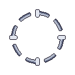 |
| `ART-UI-PU-RAY` | Icono Rayo Cósmico | 48×48, rampa `rayo` con `#FFD23F` literal en su índice 3 | `art/ui/ui_pu_cosmicray.png` | ✅ | 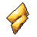 |
| `ART-UI-PU-HYD` | Icono Nube de Hidrógeno | 48×48, rampa `hidrogeno` con `#FF8FD0` literal en su índice 3. Nube con cruz ([9.2](./NOVA_GameDesign_Spec.md#92-tipos)) | `art/ui/ui_pu_hydrogen.png` | ✅ | 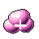 |

### A.4.5 Fondos

**Diseño cerrado.** Generador: `tools/gen_fondos_v1.py` sobre `tools/nova_fondo.py` → `art/bg/`.

2048 × 1152 px = **32 × 18 u a PPU 64**: el área jugable entera, sin scroll. Es una de las tres familias exentas de la celda de 96 ([NOVA_Arte_Tecnica.md](./NOVA_Arte_Tecnica.md), *Resolución*).

#### Las tres reglas, y las tres son comprobables

**1. Presupuesto de contraste.** La media de luminancia de **cualquier ventana de 96 × 96 px** —la celda de un nodo— se queda por debajo del **tono más oscuro de un cuerpo de nodo** (el índice 6 de las rampas de cuerpo, hoy 26.9). Si el fondo local lo supera, el lado en sombra de un nodo pasa a ser más oscuro que el cielo que lo rodea y el nodo deja de leerse como objeto iluminado para leerse como un agujero recortado. Por debajo, **todo nodo es siempre más claro que su entorno, mire donde mire la luz**. `informe()` lo verifica sobre el PNG terminado y avisa; el tope se calcula de la paleta, así que si cambia una rampa de cuerpo el presupuesto se mueve solo.

> La primera versión puso la cota en la luminancia de `CONTORNO` (18.1), razonando que el perfilado dejaría de leerse. Es falso: el contorno está a 18.1 y el fondo plano a 14.2, así que **nunca fue un perfilado de alto contraste contra el cielo**. Su trabajo es separar piezas que se solapan, no recortar la silueta. Con esa cota los tres fondos salían correctos y vacíos.

**2. Solo rampas sin significado.** Las tres rampas `bg_s1`, `bg_s2` y `bg_s3` existen para esto. Todas las demás entradas de la paleta llevan un significado de juego encima —facción, estado o power-up— y un fondo pintado con una de ellas **le miente al jugador durante toda la partida**. `gusano`, `hielo`, `decaimiento`, `rayo` e `hidrogeno` están expresamente prohibidas: son las cinco que hay que reconocer al instante en mitad del tablero. La consecuencia es que **los tres mapas no se separan por tono**, se separan por estructura y densidad.

**3. Nada del fondo puede medir lo que mide un nodo.** La huella de un nodo va de 0.6 a 1.2 u (38 a 77 px). Cualquier objeto del fondo que caiga en esa franja **es un nodo a ojos del jugador** hasta que intente clicarlo, y eso es peor que un fondo feo. Todo lo que hay está muy por debajo —grava de 8 a 20 px— o muy por encima —un planeta de 276 px—. Es la única regla de composición que no se negocia por estética.

**Y la viñeta va al revés.** En casi cualquier juego la viñeta oscurece los bordes para llevar la mirada al centro. Aquí el centro es el tablero, así que todo lo que el fondo tenga que enseñar se va a los bordes y la zona donde se juega se queda lo más vacía posible.

**Todo por trama.** No hay un solo degradado suave: cada nube es un campo de densidad resuelto con la misma matriz de Bayer 8×8 que usan el halo de la Estrella y los conos del Púlsar. Es lo que hace que el fondo pertenezca a la misma imagen que los nodos en vez de parecer una foto detrás de ellos. Lo que se modula no es el tono sino **cuántos píxeles se encienden**: la cobertura máxima de cada banda se despeja del presupuesto, no se ajusta a ojo.

| ID | Elemento | Idea | Archivo | Estado |
|---|---|---|---|---|
| `ART-BG-01` | Mapa 1 — Sistema Interior | Lleno, polvoriento, **barrido por la luz de un sol que no se ve**: está fuera del encuadre. Dibujarlo dentro metería en el tablero un objeto más brillante que cualquier Estrella, y la Estrella es el nodo que hay que encontrar primero. Su resplandor lava las estrellas de la izquierda y explica el polvo zodiacal. Un planeta interior a contraluz, del que solo se ve el filo | `art/bg/bg_section1.png` | ✅ |
| `ART-BG-02` | Mapa 2 — El Cinturón | Una corriente de escombro cruza el cielo **combada**, porque una banda recta de esquina a esquina pasa por el centro, que es donde se juega. Y **oculta estrellas**: es lo único que la hace leer como materia y no como una mancha clara | `art/bg/bg_section2.png` | ✅ |
| `ART-BG-03` | Mapa 3 — Espacio Profundo | Vacío. El único cuya idea es la ausencia: media imagen es fondo plano. Dos velos de filamentos en esquinas opuestas y una galaxia del tamaño de una uña, que está ahí para dar **escala**, que es lo que convierte el vacío en distancia en vez de en un PNG sin terminar | `art/bg/bg_section3.png` | ✅ |

**Medido sobre el PNG final** (tope 26.9):

| Mapa | Media | Peor ventana 96×96 | Margen | Colores |
|---|---|---|---|---|
| S1 Sistema Interior | 15.69 | 20.05 | +6.84 | 8 |
| S2 El Cinturón | 16.92 | 22.64 | +4.25 | 9 |
| S3 Espacio Profundo | 14.53 | 16.39 | +10.51 | 10 |

Ocho a diez colores por imagen de 2.4 millones de píxeles: son de paleta, no fotografías oscurecidas.

**Comprobación con nodos encima:** `art/_preview/fondos/s<n>_tablero.png`, con la mezcla de nodos que pide [11.2](./NOVA_GameDesign_Spec.md#112-diseño-de-niveles) para cada mapa. No son niveles reales —las coordenadas siguen pendientes— pero son lo único que responde a la pregunta que importa: si el fondo deja leer lo que va encima.

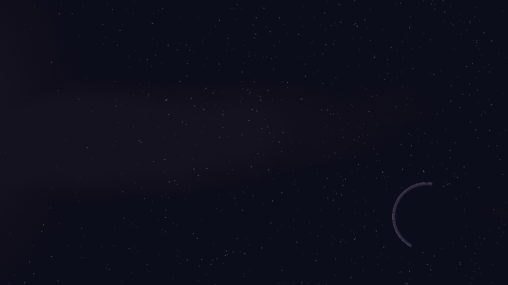
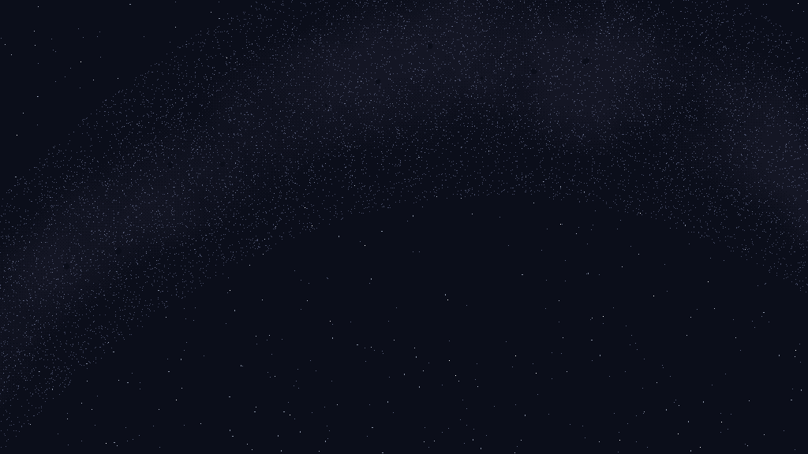
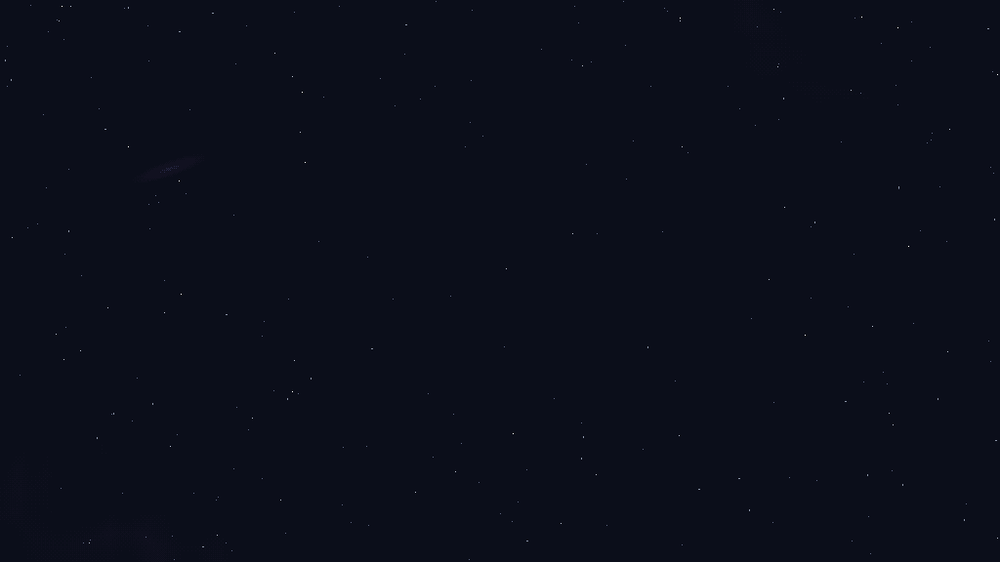

---

## A.5 VFX puntuales — [14.5](./NOVA_Estados_Animaciones.md#145-animaciones-puntuales-sin-estado)

Uno por cada `FX-*` de 14.5. Todos van al `VFXPool`. Frames = `ceil(duración × 12)`; `FX-SHOT` es instantáneo y se resuelve con el mínimo de 2 frames.

| ID de asset | Evento (14.5) | Archivo | Duración | Frames | Estado |
|---|---|---|---|---|---|
| `ART-FX-IGN` | Encendido | `art/fx/fx_ignition_sheet.png` | 0.6 s | 8 | ⬜ |
| `ART-FX-UPG` | Mejora de nivel | `art/fx/fx_upgrade_sheet.png` | 0.5 s | 6 | ⬜ |
| `ART-FX-SEND` | Lanzamiento | `art/fx/fx_send_sheet.png` | 0.2 s | 3 | ⬜ |
| `ART-FX-ABS` | Absorción aliada | `art/fx/fx_absorb_sheet.png` | 0.3 s | 4 | ⬜ |
| `ART-FX-DMG` | Daño sin captura | `art/fx/fx_damage_sheet.png` | 0.3 s | 4 | ⬜ |
| `ART-FX-SHOT` | Disparo del Magnetar | `art/fx/fx_shot_sheet.png` | instantáneo | 2 | ⬜ |
| `ART-FX-KILL` | Protón destruido | `art/fx/fx_protonkill_sheet.png` | 0.25 s | 3 | ⬜ |
| `ART-FX-THAW` | Deshielo | `art/fx/fx_thaw_sheet.png` | 0.5 s | 6 | ⬜ |
| `ART-FX-CURE` | Cura de Decaimiento | `art/fx/fx_cure_sheet.png` | 0.4 s | 5 | ⬜ |
| `ART-FX-CAST` | Lanzamiento de poder | `art/fx/fx_cast_sheet.png` | 0.4 s | 5 | ⬜ |
| `ART-FX-PWR-ZER` | Impacto Cero Absoluto | `art/fx/fx_zero_impact_sheet.png` | 0.7 s | 9 | ⬜ |
| `ART-FX-PWR-DEC` | Impacto Decaimiento | `art/fx/fx_decay_impact_sheet.png` | 0.7 s | 9 | ⬜ |
| `ART-FX-PWR-WRM` | Impacto Agujero de Gusano | `art/fx/fx_wormhole_impact_sheet.png` | 1.0 s | 12 | ⬜ |
| `ART-FX-CASCADE` | Cascada de conquista | `art/fx/fx_cascade_sheet.png` | 3.0 s | 36 | ⬜ |
| `ART-FX-VANISH` | Protones huérfanos | `art/fx/fx_vanish_sheet.png` | 0.4 s | 5 | ⬜ |

## A.6 UI — [13](./NOVA_GameDesign_Spec.md#13-controles-y-ui)

| ID | Elemento | Notas | Archivo | Estado |
|---|---|---|---|---|
| `ART-UI-HUD-ENERGY` | Número de Energía sobre el nodo | Legible sobre cualquier estado (14.7) | `art/ui/ui_energy_label.png` | ⬜ |
| `ART-UI-PANEL` | Panel de clic derecho | 6 bloques de [13.3](./NOVA_GameDesign_Spec.md#133-panel-de-clic-derecho) | `art/ui/ui_info_panel.png` | ⬜ |
| `ART-UI-BTN-UPG` | Botón de mejora | Estados normal / deshabilitado con coste en rojo / `NIVEL MÁXIMO` | `art/ui/ui_btn_upgrade.png` | ⬜ |
| `ART-UI-BTN-CONV` | Botón de reconversión | Tres destinos con coste | `art/ui/ui_btn_convert.png` | ⬜ |
| `ART-UI-IGN-MENU` | Menú radial de encendido | 3 opciones: Estrella, Púlsar, Magnetar | `art/ui/ui_ignition_menu.png` | ⬜ |
| `ART-UI-WHEEL` | Rueda de poderes del Púlsar | 3 ranuras fijas + candado con nivel requerido ([13.5](./NOVA_GameDesign_Spec.md#135-rueda-de-poderes-del-púlsar)) | `art/ui/ui_power_wheel.png` | ⬜ |
| `ART-UI-CHARGE` | Barra de carga bajo el Púlsar | **Visible también en el Púlsar enemigo** ([7.5](./NOVA_GameDesign_Spec.md#75-agujero-de-gusano)) | `art/ui/ui_charge_bar.png` | ⬜ |
| `ART-UI-POWERBAR` | Barra de poder inferior | Dos colores, crece desde los extremos | `art/ui/ui_power_bar.png` | ⬜ |
| `ART-UI-TOPBAR` | Cronómetro, nivel, pausa | [13.6](./NOVA_GameDesign_Spec.md#136-hud-permanente) | `art/ui/ui_topbar.png` | ⬜ |
| `ART-UI-END-WIN` | Pantalla de victoria | Botones Siguiente / Repetir | `art/ui/ui_end_win.png` | ⬜ |
| `ART-UI-END-LOSE` | Pantalla de derrota | Botones Reintentar / Volver al mapa | `art/ui/ui_end_lose.png` | ⬜ |
| `ART-UI-LEVELSELECT` | Mapa de selección de nivel | 3 mapas × 3 niveles, con bloqueo | `art/ui/ui_level_select.png` | ⬜ |
| `ART-UI-PAUSE` | Menú de pausa | Incluye reiniciar nivel | `art/ui/ui_pause.png` | ⬜ |

---

## A.7 Resumen de progreso

| Grupo | Total | ✅ | Bloquea |
|---|---|---|---|
| A.2 Nodos | 34 | **34** ✅ | — (ya no bloquea `T6-01`) |
| A.3 Estados | **9** | **9** ✅ | — (ya no bloquea `T6-02` ni `T6-03`) |
| A.4.1 Radio del Magnetar | 4 | 0 | Legibilidad del Magnetar (fase 2 visual) |
| A.4.2 Protón y proyectiles | 9 | 0 | `ProtonVisual`, fase 6 |
| A.4.3 Selección y apuntado | 5 | 0 | Pulido de input (fase 6) |
| A.4.4 Power-ups | 3 | **3** ✅ | — |
| A.4.5 Fondos | 3 | **3** ✅ | — |
| A.5 VFX | 15 | 0 | `VFXPool`, fase 6 |
| A.6 UI | 13 | 0 | Pulido de UI (fase 6) |
| **Total** | **95** | **49** | — |

El total sube de 90 a 94 porque el Protón pasa de 2 archivos a 6 (A.4.2), y de 94 a 95 porque `SinEncender` necesita **dos** assets y no uno: `ART-ST-IGN` y `ART-ST-READY` tienen distinto número de frames y no caben en una fila (A.3.2).

**A.2 está cerrado: los cuatro nodos, 34 de 34.** Estrella `ART-NOD-STR-01…05` (10), Púlsar `ART-NOD-PUL-01…03` (6), Magnetar `ART-NOD-MAG-01…05` (15, tres facciones) y Asteroide `ART-NOD-AST-00N/P/E` (3). **`T6-01` deja de estar bloqueada por arte** ([NOVA_Tracking.md](./NOVA_Tracking.md), T.4): su dependencia `ART-NOD-*` está completa, y a partir de aquí solo la retiene su dependencia de código.

Lo que sigue bloqueando la fase 6 son los otros nueve grupos de este inventario, empezando por A.4.1 (radio del Magnetar).

**A.3 está cerrada: los nueve overlays de estado, 9 de 9.** Con `ART-NOD-*` (A.2) y `ART-ST-*` (A.3) completos, **`T6-02` y `T6-03` dejan de estar bloqueadas por arte** ([NOVA_Tracking.md](./NOVA_Tracking.md), T.4): las tres primeras tareas de la fase 6 solo las retiene ya su cadena de código. Lo que queda por delante son cuatro grupos de mundo y UI —A.4.1, A.4.2, A.4.3 y A.6— y los quince VFX de A.5.

**Esta sección daba por hecho que los cinco últimos de A.3 serían más fáciles que los cuatro primeros**: van sobre el cuerpo entero, así que no tienen que caber en un hueco como los dos del Asteroide ni registrar con nada como `Asustado`. **La segunda mitad resultó falsa las cinco veces.** Un tinte sí registra, y con tres cosas: la **cara**, porque 14.6 lo hace convivir con `Asustado`; el **contador de nivel**, porque A.8 #2 lo dejó solo en el sprite —y en los trece nodos encendidos esas dos ocupan entre las dos todos los radios de la celda (A.3.4)—; y **los otros tintes**, porque 14.6 también los hace coexistir y dos campos de Bayer apilados acaban en un borrón (A.3.5, A.3.8). Y el quinto ni siquiera era un tinte: el buff resultó ser un glifo de esquina (A.3.8).

**Lo que sí quedó de aquella previsión es la vara.** `verifica_tinte` empezó midiendo tres cosas y acabó midiendo nueve, y cada una la pidió un asset concreto: cara libre, contador, contraste (A.3.4), cierre del bucle, frames distintos, convivencia con otro overlay (A.3.5), reparto aire/cuerpo (A.3.5), modo transitorio con frames ciegos (A.3.6) y arranque en el pico (A.3.7). **Ninguna se añadió por precaución; todas se añadieron después de que algo se colara.**

**Pendiente aparte del inventario:** las hojas de idle de Estrella y Púlsar (16 frames cada una) no tienen ID propio todavía. Su idle está diseñado y los dos generadores animan por `t`; falta volcarlas a `_sheet.png`. El Magnetar no aporta hojas: resuelve su idle por transform (A.2.4). Las 15 que hay generadas son de la v2 descartada y se quedan en `v2/`.

**Infraestructura lista y reutilizable para todo lo demás:** paleta completa de **22 rampas** (`tools/nova_paleta.py`), **18 primitivas de nodo** en `tools/nova_core.py` y **7 primitivas de fondo** en `tools/nova_fondo.py`. Estado de uso real:

| Primitiva | La ejercita |
|---|---|
| `esfera` | Estrella, Púlsar (ojos), Magnetar (ojos) |
| `esferoide` | Púlsar v2, Magnetar v2 (núcleo y yugos, descartada), `ART-ST-SCARE` (esclerótica y pupila) |
| `corona_radial` | Estrella |
| `halo_trama` | Estrella |
| `cono_trama` | Púlsar v2 |
| `anillo_orbital` → `tubo_curva` | Púlsar v2 |
| `linea_dipolar` | Magnetar v2 (descartada) |
| `bulto` | Asteroide v1, `ART-ST-IGN` (la brasa) |
| `crater` | Asteroide v1 |
| `veta` | Asteroide v1, Magnetar v1, `ART-ST-SLEEP` (los glifos `Z`), `ART-ST-READY` (los trazos de la chispa) |
| `poliedro` | Magnetar v1 (cuerpo y esquirlas) |
| `esquirla` | Asteroide v2 (descartada) |
| `estratos` | Asteroide v2 (descartada) |
| `anillo` | Halo de power-up (A.4.4) |
| `tramar` | `ART-ST-FROZEN` (la escarcha que brota de la grieta), `ART-ST-DECAY` (la nube), `ART-ST-CONV` (la estela, el filo y el corte), `ART-ST-CAP` (los dos anillos), `ART-ST-BUFF` (el punto de apoyo) |
| `veta_luz` | `ART-ST-FROZEN` (la red de grietas), `ART-ST-DECAY` (las gotas), `ART-ST-BUFF` (los chevrones) |
| `tubo_gota` | **nadie todavía** |

**Las primitivas de una propuesta descartada no se retiran.** `linea_dipolar` (Magnetar v2), `esquirla` y `estratos` (Asteroide v2) siguen en el catálogo: son materiales que no existían —un tubo cerrado de grosor variable, contorno recto con sombreado curvo, y capas paralelas sin centro— y están probadas sobre sprites reales. Lo que se descarta es un diseño, no una herramienta. Los tres cuerpos disponibles cubren ya las tres combinaciones posibles:

| | contorno | sombreado | lee como |
|---|---|---|---|
| `poliedro` | recto | caras planas | cristal tallado |
| `bulto` | suave | curvo | canto rodado |
| `esquirla` | recto | curvo | piedra rota |

`elipse_base_plana` aparece en el catálogo de [NOVA_Arte_Tecnica.md](./NOVA_Arte_Tecnica.md) pero **no está implementada**. Ver T.7 en [NOVA_Tracking.md](./NOVA_Tracking.md).

**Ningún nodo heredó de otro, y es deliberado.** Este documento dio por hecho una vez que el Magnetar heredaría `anillo` y `anillo_orbital`. No heredó ninguna de las dos, y fue lo mejor que le pasó al diseño; el Asteroide tampoco heredó nada de los tres anteriores. Cada uno estrenó las primitivas que su material pedía, y por eso el catálogo pasó de 9 a 16 mientras se cerraban dos nodos. **Un nodo construido con las piezas de otro se parece a otro** (A.8, y contrato, *Reglas de trabajo*). `anillo` sigue sin estrenar: la usará el radio del Magnetar.

---

## A.8 Decisiones de diseño cerradas

Ninguna decisión de art design queda abierta. Se conservan aquí con su motivo, porque un "por qué" olvidado se reabre solo.

| # | Pregunta | Decisión | Motivo |
|---|---|---|---|
| 1 | ¿El radio del Magnetar se ve siempre o solo al seleccionar? | Siempre en neutrales y enemigos; a demanda en los propios | Es información defensiva crítica para trazar ruta. Mostrar los propios satura sin aportar. |
| 2 | ¿El nivel se indica solo por el sprite, o con pips/números? | **Solo sprite** | Cero UI extra. Se sostiene con señales redundantes: tamaño, temperatura del núcleo, densidad de atmósfera y halo. Coste asumido: el escalón N3→N4 es el más débil. |
| 3 | ¿El Magnetar neutral usa gris o una tercera paleta? | Rampa `mag_n`, gris acerado derivado de `neutral` | Una tercera paleta propia lo convertiría en un tercer bando a ojos del jugador, y no lo es. |
| 4 | ¿Tamaño de sprite por tipo en unidades de mundo? | Huella de **0.6 u a 1.2 u**; celda 96 px = 1.5 u, **PPU 64** | Con nodos más pequeños el clic se vuelve incómodo; con nodos más grandes, un Magnetar N1 (radio 2.0 u) apenas sobresaldría de su propio sprite y su anillo dejaría de informar. |
| 5 | ¿Los nodos tienen cara/ojos? | **Sí, en todos** | [14.2](./NOVA_Estados_Animaciones.md#142-animación-de-susto) pide "ojos muy abiertos" para el susto. Sin cara habría que inventar otra señal para la lectura más importante del juego. |

### Cerradas fuera de A.8

| Asunto | Decisión | Dónde vive ahora |
|---|---|---|
| Contradicción de frames | **12 fps fijo**, `frames = ceil(duración × 12)`; bucles a 16 | A.3, A.5 y el contrato |
| Idle de los nodos | Híbrido: transform para Asteroide y Magnetar, hoja de 16 frames para Estrella y Púlsar | Contrato, sección Animación |
| Tipografía | Una única pixel font libre, en TextMeshPro | Contrato, Importación en Unity |
| Escala del protón | Tres sprites discretos de 48 px, no escala continua | A.4.2 |
| Assets fuera de la celda de 96 | Radio del Magnetar, fondos y protón son familias con resolución propia | Contrato, sección Resolución |
| Señal de nivel del Púlsar | **Frentes de onda contables** sobre un eje inclinado, no púas radiales. Se descartó una v1 entera por parecerse a la Estrella | A.2.3 |
| Señal de nivel del Magnetar | **Esquirlas capturadas**, una por nivel, aditivas y posicionales: el ángulo y la distancia de cada una son fijos y la más externa marca el alcance. Se descartó una v2 entera («La Botella») por leer recinto en vez de densidad y por dejar la cara más pequeña de los cuatro | A.2.4 |
| Partición de materiales | Estrella **luz continua**, Púlsar **luz tramada**, Magnetar **materia** (cero `glow`). Es un eje de separación de primer orden, como la silueta o la simetría | Contrato, A.2.4 |
| Idle del Magnetar | **Transform**, el lado que le da el contrato: no tiene nada interno que mover. La excepción se abrió para «La Botella» y se cierra con ella | Contrato, A.2.4 |
| Luz propia del Asteroide | **Ninguna.** Es el único nodo que solo refleja; su píxel más claro es un reflejo. Cierra la partición de materiales | A.2.1 |
| Acabado del Asteroide | **Mate, sin especular.** Única excepción a la regla 3 del contrato: una roca lijada por micrometeoritos no es material pulido | Contrato, A.2.1 |
| Cara del Asteroide | **Ojos cerrados**, dos rendijas asimétricas. Sirve igual para `Dormido` y para `SinEncender`; los abre `ART-ST-SCARE` | A.2.1 |
| Marca de posesión del Asteroide | **El overlay `ART-ST-IGN`, no el sprite.** Ninguna geometría cambia entre facciones (14.0 #3) | A.2.1 |
| Cota de brillo de un fondo | La media de cualquier ventana de 96×96 por debajo del tono más oscuro de un cuerpo de nodo, calculado de la paleta | A.4.5 |
| Color de un fondo | **Solo rampas sin significado** (`bg_s1/2/3`). Las cinco con significado de juego están prohibidas. Los mapas se separan por estructura, no por tono | A.4.5 |
| Tamaño de lo que hay en un fondo | Nada puede caer en la franja de huella de un nodo (0.6–1.2 u): o muy por debajo o muy por encima | A.4.5 |
| Viñeta | **Al revés**: mínima en el centro. El centro es el tablero | A.4.5 |
| Señal de nivel del Asteroide | No tiene: un solo nivel. Todo el trabajo de lectura se va a la facción | A.2.1 |
| Varias propuestas por nodo | Conviven en `art/nodes/<nodo>/v<n>/`; la descartada no se borra | A.1 |
| Varias propuestas por overlay | Misma regla que los nodos, en `art/states/<estado>/v<n>/`. El generador declara `ESTADO` y `VERSION` y escribe con `dir_estado(estado, version)` | A.1, A.3 |
| Trama en los overlays | **Solo los que cubren el cuerpo** —tintes y auras: `Congelado`, `Infectado`, buff—. Un **glifo** de estado (`zzz`, icono de ignición) va sólido y con contorno: vive fuera del cuerpo y compite con el fondo, no con el nodo. Tramado sería un borrón | A.3, A.3.1 |
| Independencia del tipo en los overlays | **Vale para los cuatro que van sobre cualquier nodo.** `Dormido` y `SinEncender` solo se aplican al Asteroide, y se colocan contra su silueta: la unión de los cuatro nodos deja un hueco libre de 20 px en esquina y un `zzz` legible necesita 33×16 | A.3.1 |
| Señal de `Dormido` | **Tres glifos `Z` que cabecean en su sitio**, con la fase retrasada hacia fuera. No viajan: un estado permanente no avanza. Se descartó una v1 entera («La escalera») porque su relevo apaga un glifo de golpe | A.3.1 |
| Señal de `SinEncender` | **Una brasa**, quieta mientras `energy < 10` y abierta en cinco trazos que crepitan cuando llega a 10. Se descartó una v1 entera («El interruptor») por meter el primer icono de interfaz dentro del tablero | A.3.2 |
| Señal de `Asustado` | **Un ojo muy abierto**, esclerótica clara y pupila contraída y baja. Se instancia dos veces por nodo. Se descartó una v2 entera («La pupila dilatada») por hablar de pavor y no de sobresalto, que es lo que 14.2 describe | A.3.3 |
| Anclaje de un overlay que va sobre la cara | **Tallas discretas más desplazamiento entero**, nunca escala: una escala no entera rompe el pixel-perfect. Es la misma decisión que el protón, aplicada a otro sitio. La tabla vive en `tools/nova_estados.py` | A.3.3, A.4.2 |
| Forma del ojo asustado | **Más alto que ancho.** No es una licencia: el ancho lo raciona la separación entre ojos —9.5 px en el Púlsar N1— y el ojo tiene que tapar uno de 10 px en la Estrella N5. Con ojos redondos el intervalo es vacío | A.3.3 |
| Cuándo un asset pequeño no se anima | **Cuando la rejilla se come el movimiento.** Si una hoja de 16 frames no contiene 16 imágenes distintas, no es una animación. Medido antes de decidir, no después | A.3.3, contrato |
| Las dos lecturas de `SinEncender` | **Variante visual, no estado nuevo.** El animador lee `energy >= 10` (14.0 #1); `NodeState` y la matriz de 14.6 no se tocan. El *parpadeo* que 14.1 pedía para todo el estado pasa a ser la firma de la lectura accionable | A.3.2, 14.1 |
| Peso relativo de dos lecturas del mismo overlay | **La accionable nunca pesa menos que la pasiva**, en ningún frame. 141 px la brasa contra 143–196 el abanico. Es lo que fija el suelo del parpadeo, no el gusto | A.3.2 |
| Señal de `Congelado` | **Una red de grietas que cruza el nodo**, sin centro ni eje, con la escarcha brotando de la propia grieta. El hielo no es una capa, es una fractura: una línea cruza y no tapa. Se descartaron dos propuestas enteras, «La escarcha» y «El bloque»; la segunda llegó a estar elegida y se cayó por ser la primera figura de contorno recto y regular dentro del tablero, que es el argumento que ya descartó la v1 de `ART-ST-IGN` | A.3.4 |
| Cómo cruza la cara un overlay | **Por el pasillo de 4 px que hay entre los dos ojos** en los trece nodos encendidos, `x 45-49`. Medido, no supuesto. Es lo que permite que una grieta atraviese la cara sin tocarla, y cruzarla es lo que la hace leer como grieta | A.3.4 |
| Señal de `Infectado` | **Una nube tramada con cizalla, sesgada hacia abajo, que respira**, más cinco gotas que caen. Es la lectura literal de 14.1 y gana por presencia: es la única de las tres propuestas que se lee de un vistazo en los trece. Un estado indefinido que el jugador tiene que curar no se puede permitir pasar desapercibido | A.3.5 |
| Ciclo de un aura | **Radial, no giratorio.** Hacer viajar la fase de la onda no cierra el bucle salvo dando una vuelta entera, y una vuelta en 16 frames a 12 fps es un aura que gira, que es lo que la regla 6 del contrato quiere evitar. El ciclo lo llevan el radio y la densidad, desfasados entre sí | A.3.5, contrato |
| Alcance real de cada overlay | **Ninguno va sobre los cuatro nodos.** `Congelado`, `Infectado` y el buff son **trece** sprites: 14.1 los limita a nodos encendidos y el Asteroide nunca lo está. `Reconvirtiendo` son doce (solo propios). Solo `Asustado` y `Capturado` van sobre los catorce. La lista vive en `tools/nova_estados.py` | A.3, A.3.4 |
| Contorno en algo que se dibuja encima de un nodo | **Ninguno.** Sobre un sprite ya terminado el contorno no separa, tacha: engorda cada línea de 1 a 3 px y los dos de más son negros. Medido, doce aristas con contorno se comían el 71 % de un frente de onda del Púlsar. Se añade `veta_luz` para eso; `veta` sigue siendo materia y sigue llevándolo | Contrato, A.3.4 |
| Qué se le mide a un overlay que cubre el cuerpo | **Cara libre, contador de nivel y contraste.** Las tres sobre los sprites reales, en `verifica_tinte`. La vara de un glifo —cero píxeles sobre el cuerpo, `glow` limpia— suspendería a un tinte por hacer su trabajo | A.3 |
| Facciones en los overlays | **Las llevan `ART-ST-IGN`, `ART-ST-READY` y `ART-ST-CONV`**, y por dos motivos distintos. Los dos primeros porque A.2.1 cerró que la marca de posesión del Asteroide es el overlay y no el sprite; el tercero porque durante la reconversión el nodo **sigue siendo tuyo** (8.1) y pintarlo de gris diría lo contrario. Color literal de 14.4 en `str_p` y `str_e`; no hay rampa de facción genérica | A.2.1, A.3.2, A.3.6 |
| Qué quiere decir «silueta neutra» en 14.1 | **Sin tipo, no sin bando.** 8.1 dice que el nodo sigue siendo suyo los 3 s —tanto que puede ser capturado, y entonces la reconversión se cancela—. Leído como «gris Neutral», el texto contradice a 8.1 | A.3.6, 14.1 |
| Quién dibuja el colapso de `Reconvirtiendo` | **El animador, cambiando de sprite.** Un overlay aditivo no puede borrar ni recolorear lo que hay debajo. El asset solo tapa el corte, y para eso hace falta cubrir la unión de los trece reconvertibles: un disco de radio 45, medido | A.3.6 |
| El blanco puro dentro del tablero | **Es de `ART-ST-CAP`.** La reconversión destella en el color de facción y no en blanco, porque 8.1 permite que capturen un nodo mientras se reconvierte y los dos eventos no pueden empezar igual. El índice 0 de toda rampa está reservado al especular, y este es el único overlay que lo usa como color propio | A.3.6, A.3.7, 14.5 |
| Señal de `Capturado` | **Dos anillos blancos que se cruzan en el frame central**, uno cerrándose y otro saliendo. No es una explosión, es un cambio de manos, y es lo único del tablero que lo dibuja en vez de solo anunciarlo. Se descartó «El fogonazo», la lectura literal, por gastar el gesto más genérico del juego en uno de los quince VFX de A.5 | A.3.7 |
| Si la geometría cambia con la facción | **No cambia en ninguno de los catorce**, comprobado byte a byte sobre los 34 sprites. Por eso `ChangeFaction()` no deja corte que tapar y `ART-ST-CAP` puede prescindir del relleno, al revés que `ART-ST-CONV` | A.3.7, 14.0 #3 |
| Cómo entra un efecto con duración | **Depende de si se prepara o se dispara.** Uno que se prepara —`Reconvirtiendo`— entra desde nada; uno que se dispara —`Capturado`— arranca en su pico, porque el suceso que lo lanza es instantáneo. **Salir a nada lo cumplen los dos**, porque después de los dos viene `Normal` | A.3.6, A.3.7, contrato |
| Qué se le mide a un efecto con duración | **Que entre desde nada y salga a nada**, que todos sus frames interiores sean distintos, y **cuántos frames deja la cara ciega** —no si la tapa—. La unión de frames, que es la vara de un estado, aquí no dice nada: un efecto que tapa el nodo un instante no tapa la cara, la tapa durante N frames, y lo que hay que acotar es N | A.3.6 |
| Señal de un power-up activo | **Un galón de dos chevrones en la esquina inferior derecha**, en el color del power-up y **estático**. No es un tinte: es un glifo, y cae entero fuera del sprite en los trece. Se descartó «El sobrecalentado», el aura que late, porque sobre un nodo infectado y buffeado se funde con la nube de `Infectado` | A.3.8 |
| Sobre qué nodos va el buff | **Solo sobre los que el power-up afecta**: Rayo a Magnetar y Púlsar, Hidrógeno a Estrella. El Asteroide no gana nada con ninguno y marcarlo prometería una ventaja que no tiene. Consecuencia: ningún nodo lleva nunca los dos buffs, aunque 9.1 permita que los dos estén activos | A.3.8 |
| Color de un overlay de power-up | **El del power-up, no el de la facción.** A.4.4 decidió lo contrario para el halo del drop porque allí el icono flotante dice cuál es; sobre un nodo buffeado no flota nada, así que el overlay es lo único que puede decirlo | A.3.8, A.4.4 |
| El cuadrado libre de la esquina | **23 px en los catorce nodos**, 33 si solo se cuentan Magnetar y Púlsar. A.3.1 midió 20 y concluyó que ahí no cabe un `zzz` de 33×16; sí cabe una marca | A.3.1, A.3.8 |
| Exenciones al contador de nivel | **Una sola, y es `Reconvirtiendo`**: durante esos 3 s el nivel está cambiando —acaba en N1 del tipo nuevo— y no hay contador fiable que proteger. No se hereda: la tiene porque su duración coincide con la del cambio | A.3.6 |

### Ejes de diseño ya ocupados

Un nodo no se separa de otro repintándolo: si comparten silueta, simetría, material y composición, se seguirán pareciendo con cualquier paleta (contrato, *Reglas de trabajo*). Esta tabla es el inventario de lo que ya está cogido, y se consulta **antes** de diseñar el que falta.

| Eje | Estrella | Púlsar | Magnetar | Asteroide |
|---|---|---|---|---|
| Silueta | disco con púas | reloj de arena | cúmulo disperso: cuerpo + satélites | contorno orgánico irregular |
| Simetría | radial *n*-fold, centrada | bilateral sobre eje a 32° | ninguna (ángulo áureo, eje vertical) | ninguna |
| Material | banda sólida + halo | trama Bayer sobre `glow` | materia facetada, vetas incandescentes | superficie **cóncava**, mate |
| Composición | isotrópica | direccional, diagonal | dispersa, centrífuga | excéntrica, por puntos |
| Cuerpo | esfera | esferoide achatado | `poliedro` tallado | `bulto` armónico |
| Espacio interior | macizo | macizo | macizo | macizo |
| Luz propia | sí | sí | sí (vetas, sin `glow`) | **ninguna** |
| Contador de nivel | púas radiales (gradual) | frentes de onda | esquirlas capturadas (aditivo posicional) | *no tiene: un solo nivel* |
| Idle | hoja, 16 frames | hoja, 16 frames | **transform** | **transform** |

**Lo que cambió al cerrar el Magnetar en «El Yunque»** (A.2.4): *espacio interior* pasa a ser **macizo en los cuatro** —el calado se va con la v2 descartada— y deja de separar a nadie, así que **`calado` queda como valor libre** para el primer nodo que lo necesite. Y el par **Magnetar–Asteroide** pasa a compartir dos casillas, *simetría* («ninguna») e *idle* (transform); es el único par que comparte *simetría*, que es el eje del que más depende la lectura. Se separan igual en las seis restantes —silueta, material, composición, cuerpo, luz propia y contador—, más la rampa. Queda escrito porque un solape conocido no se reabre solo.

**Los cuatro nodos están cerrados y ningún par comparte más de tres de las nueve casillas**: el peor caso es Magnetar–Asteroide, y aun ese se distingue en seis. La tabla deja de ser una lista de huecos libres y pasa a ser el registro de por qué el reparto se distingue: cualquier asset nuevo que vaya junto a un nodo —un overlay de estado, un VFX, un proyectil— se comprueba contra ella antes de dibujarse, porque las colisiones de lectura ya no vienen de los nodos entre sí, sino de lo que se les ponga encima.

Dos principios que salieron de llenarla, y que valen para lo que queda:

- **La concavidad y la convexidad son materiales distintos**, no dos ajustes del mismo. Todo el reparto abulta menos el Asteroide, y es lo único que lo separa de los demás sin tocar la paleta.
- **Un accidente de superficie modula la banda que hay, no la sustituye.** `crater` y `estratos` lo hacen así. Pintando bandas absolutas, un accidente colocado en la mitad en sombra sale más claro que lo que lo rodea y se invierte: el hoyo se lee como bulto. El error nunca se ve en el lado iluminado, solo en el oscuro.
